# Architecture — DGRV Digital Gap Assessment Tool (GAT)

> **As-built** documentation of the current system. This describes what is actually
> deployed and running, not a target/aspirational design. For the original design
> vision see `doc/Arc42.md`; this document supersedes it as the authoritative
> "how it really works" reference.

## 1. Overview

The **DGRV Digital Gap Assessment Tool (DGAT)** is a Progressive Web App (PWA) that
lets cooperatives assess their digital maturity across a set of dimensions, define a
desired ("to-be") target level, and receive computed gap analysis together with
recommendations and an actionable action plan. Results are exported as PDF and Word
reports. The whole experience is **offline-first**: assessments can be completed
without connectivity and sync once back online.

The product supports a hierarchy of users:

- **DGRV Admin** (`dgrv_admin`) — platform-wide administrator (DGRV staff).
- **Organisation Admin** (`org_admin`) — manages one Keycloak *Organisation* (a
  partner organisation) and the cooperations/groups inside it.
- **Cooperative Admin** (`coop_admin`) — manages one cooperative (a Keycloak
  *Group*) and its members.
- **Cooperative User** (`coop_user`) — end user performing assessments for a
  cooperative.

### 1.1 Role Hierarchy

The product is organised around a four-tier role model. Privilege flows top-down:
the DGRV Admin manages Organisation Admins, who in turn manage Cooperative Admins, who
manage Cooperative Users. A Cooperative Admin is also implicitly a Cooperative User,
since both must be able to perform assessments. The diagram below renders this
inheritance/management chain. **Crucially, this hierarchy is enforced only on the
frontend** (via `ProtectedRoute` — see §3.3); the backend does not check it for most
endpoints (see `RBAC_AND_ROLES.md` § "Security gaps").

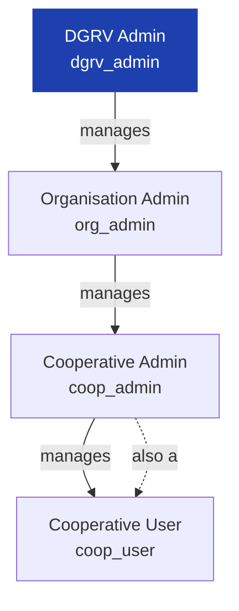

### 1.2 Organisational Model (Keycloak)

Identity and organisational structure are **outsourced to Keycloak** — the application
database holds no user or organisation tables; it only stores denormalized string IDs
(`organization_id`, `cooperation_id`) sourced from the JWT. Keycloak's **Organizations**
preview feature represents a partner union/organisation, while standard Keycloak
**Groups** represent individual cooperatives beneath each organisation. Users are
members of a group (cooperative) which belongs to an organisation. The diagram below
shows this containment hierarchy and how the four roles map onto it.

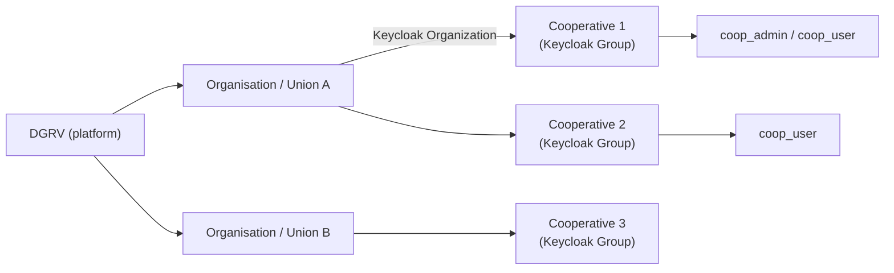

## 2. High-Level Topology

DGAT runs on a **single EC2 host**. On that host, a system-level Nginx instance
terminates TLS using a Let's Encrypt certificate (managed by `certbot`) and
reverse-proxies traffic into a Docker Compose stack of six containers that share a
bridge network (`dgrv-net`). The frontend container also runs an inner Nginx that
serves the built SPA and can proxy `/keycloak/` and `/api/` into the docker network —
useful for local and single-host setups. In production the host Nginx typically
proxies directly to the backend and Keycloak. The diagram below shows who talks to
whom, including the backend's outbound calls to Keycloak (Admin REST, via a service
account) and to MinIO (object storage for reports).

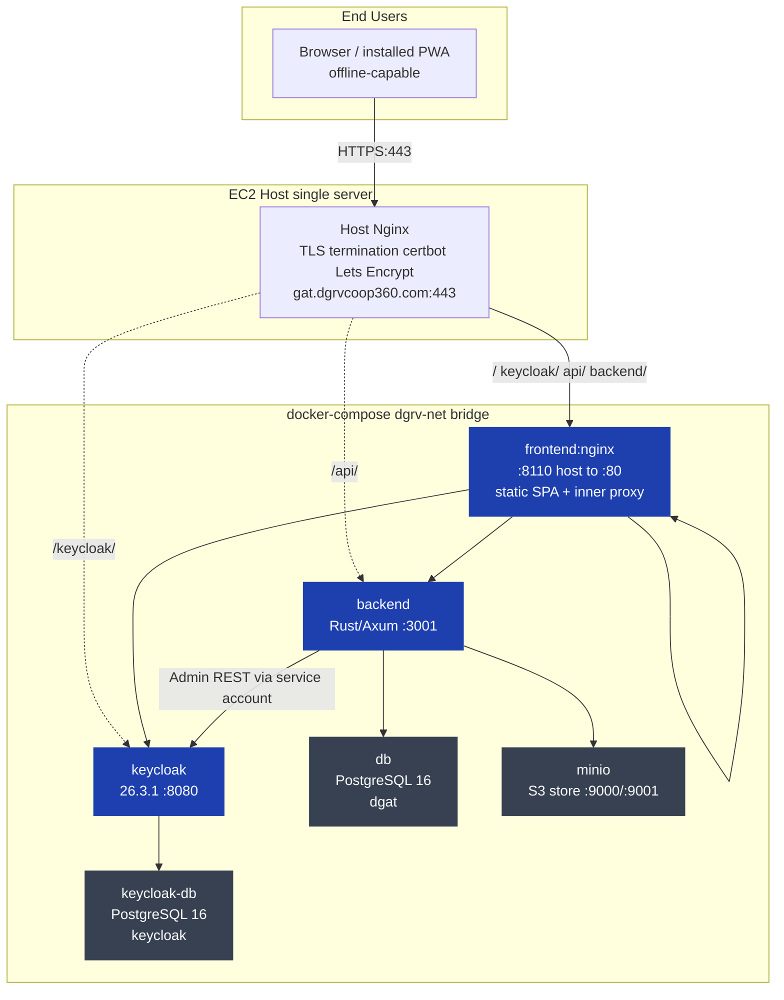

- **Host Nginx** (installed on the EC2 host, **outside** docker-compose) terminates TLS
  with a Let's Encrypt certificate and reverse-proxies paths into the docker network.
- The **frontend** container runs its own inner Nginx serving the Vite build; it also
  proxies `/keycloak/` and `/api/` into the docker network (used for local/single-host
  setups). In production the host Nginx usually proxies directly to backend/keycloak.
- All containers share the `dgrv-net` bridge network.

### Docker Compose services (`docker-compose.yml`)

| Service | Image | Host port | Internal | Purpose |
|---|---|---|---|---|
| `backend` | built `dgrv-digital-gap-tool-backend` | `3001` | `3001` | Rust/Axum API |
| `frontend` | built `dgrv-digital-gap-tool-frontend` | `8110` | `80` | Static SPA + inner proxy |
| `keycloak` | `quay.io/keycloak/keycloak:26.3.1` | `8080` | `8080` | IAM (organizations preview feature) |
| `keycloak-db` | `postgres:16-alpine` | — | `5432` | Keycloak's own DB (`keycloak`) |
| `db` | `postgres:16-alpine` | `5430` | `5432` | Application DB (`dgat`) |
| `minio` | `minio/minio:latest` | `9000` / `9001` | `9000` / `9001` | S3-compatible object store for reports |

### Startup order (with health gates)

The compose file wires inter-service dependencies with `depends_on: condition:
service_healthy` so that containers start in a reliable order rather than racing.
The backend will not boot until the app DB, Keycloak, and MinIO all report healthy.
Keycloak in turn waits for its own Postgres, then runs a provisioning script after it
becomes ready. The diagram below shows these gated dependencies and the side-effects
each service performs once it starts.

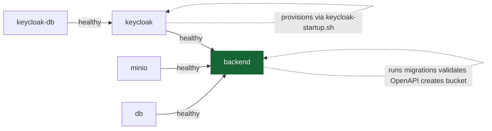

## 3. Component Architecture

### 3.1 System Component Map

Before diving into each subsystem, the diagram below shows the **whole system on one
page**: the frontend's internal concerns (routing, layouts, Dexie, sync, auth, i18n,
service worker, generated API client), the backend's internal layers (auth, API,
services, repositories, entities, OpenAPI), and the external/infrastructure
components they talk to (Keycloak, PostgreSQL, MinIO, and the headless Chromium used
for report rendering). Arrows are the real runtime dependencies — including the
backend's outbound calls to Keycloak/MinIO/Chrome and the OpenAPI contract that feeds
the frontend codegen. Use this map to locate any feature end-to-end.

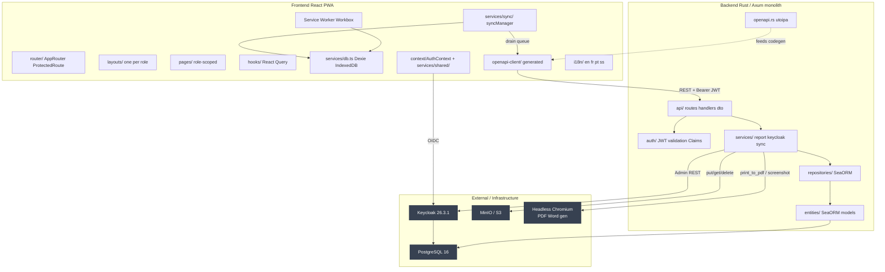

### 3.2 Backend (Rust / Axum)

A **single monolithic** Rust binary (`dgat-backend`, packaged as
`dgrv-digital-gap-tool`) using **Axum 0.7** + **SeaORM 0.12** on Tokio. It is *not*
split into microservices despite what `doc/Arc42.md` describes.

Source layout (`src/`):

```
src/
├── main.rs              # entrypoint → lib::run()
├── lib.rs               # AppState, create_app(), OpenAPI startup validation
├── config.rs            # env-driven Config (envconfig)
├── database.rs          # init_db(), run_migrations()
├── error.rs             # AppError enum → HTTP status mapping
├── api/
│   ├── routes/          # axum routers, one per resource (+ api.rs orchestrator)
│   ├── handlers/        # request handlers (one per resource)
│   ├── dto/             # request/response DTOs + OpenAPI schemas
│   ├── openapi.rs       # utoipa OpenApi doc + Swagger UI
│   └── middleware.rs    # (dead) stub middleware
├── auth/
│   ├── claims.rs        # Claims extractor + role helpers
│   ├── jwt_validator.rs # biscuit JWT validation against Keycloak JWKS
│   └── middleware.rs    # global auth middleware (Bearer → Claims)
├── services/            # business logic (report gen, keycloak client, sync…)
├── repositories/        # SeaORM data-access layer (one per entity)
├── entities/            # SeaORM entity models (mirror DB tables)
├── models/              # non-DB DTOs (Keycloak API models)
└── bin/seed.rs          # seeding binary (cargo run --bin seed)
```

#### Request processing layers

Every HTTP request passes through the same ordered chain inside the backend. First
the Axum router matches a path, then a global CORS layer normalises cross-origin
headers, then the **global auth middleware** validates the bearer JWT and injects
`Claims` into request extensions. Only after that does a handler run, which in turn
delegates to a service, which delegates to a repository, which loads SeaORM entities
from Postgres. Services may also make outbound calls to Keycloak (Admin REST),
MinIO, or headless Chrome — those are side-channels, not part of the inbound chain.
The diagram below visualises this pipeline and the strict one-directional layering
rule the codebase follows.

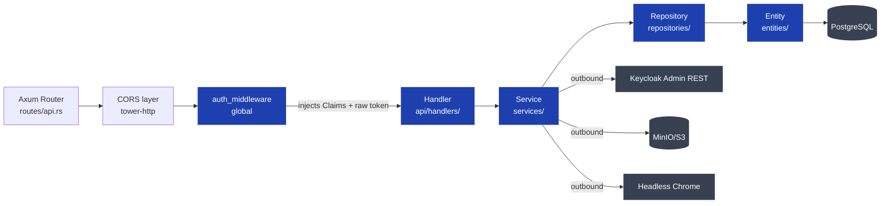

**Layering rule:** requests flow in ONE direction:
`Route → Middleware → Handler → Service/Repository → Database`. Never skip layers.
`services/keycloak.rs` is an outbound HTTP client to the **Keycloak Admin REST API**
(service account `dgat-admin-client` with `realm-admin`).

**AppState** (`lib.rs:26`) is shared with every handler via Axum's `State` extractor.
It bundles the four long-lived, clone-on-cheap handles the request pipeline needs —
the SeaORM database connection, the Keycloak Admin client, the JWT validator, and
the report service (which owns the MinIO/S3 client):

```rust
struct AppState {
    db: Arc<DatabaseConnection>,
    keycloak_service: Arc<KeycloakService>,
    jwt_validator: Arc<JwtValidator>,
    report_service: Arc<ReportService>,
}
```

#### Backend startup sequence

When the backend container starts, `main.rs` calls `lib.rs::run()`, which performs a
fixed sequence of initialisation steps before the server begins accepting traffic.
Notably, the OpenAPI spec is **validated** at startup — in release builds an invalid
utoipa annotation will panic the process so a broken spec never reaches production.
Migrations are applied automatically (no manual `migrate` step is required), and the
report service ensures the MinIO bucket exists before serving. The sequence diagram
below traces every step from binary entry to "listening on host:port".

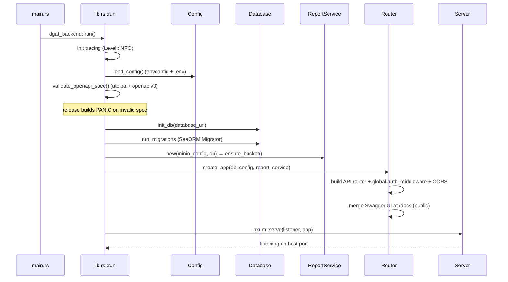

### 3.3 Frontend (React PWA)

A **Vite + React 18 + TypeScript** SPA, styled with Tailwind + shadcn/ui (and some MUI),
state via **TanStack React Query** + **Dexie** (IndexedDB). Authentication via
**keycloak-js**. Offline-first with a Workbox service worker and a custom sync manager.

#### Frontend bootstrap sequence

`main.tsx` is the single place that calls `keycloak.init()` (intentionally — no other
module re-inits Keycloak). It seeds the OIDC client with any cached tokens from
IndexedDB so a returning user doesn't immediately bounce to the login page, and it
implements an **offline fallback**: if Keycloak is unreachable but cached tokens
exist, the app re-hydrates the token by base64-decoding the JWT payload and carries
on offline. After auth resolves it registers the service worker, mounts the
`AuthProvider`, seeds the sync manager, and installs an Axios/OpenAPI interceptor
that attaches the bearer token to every generated-client request. The sequence
diagram below shows this boot path including both the online and offline branches.

```mermaid
sequenceDiagram
    participant MX as main.tsx
    participant KC as keycloak-js
    participant IDB as IndexedDB (idb-keyval)
    participant AC as AuthContext
    participant SM as syncManager
    participant SW as Service Worker
    participant OC as OpenAPI client

    MX->>IDB: get("auth_tokens")
    IDB-->>MX: cached tokens (if any)
    MX->>KC: init with cached token, refreshToken, onLoad=check-sso, pkce=S256
    alt online success
        KC-->>MX: authenticated
        MX->>IDB: storeTokens()
    else offline / unreachable
        MX->>MX: rehydrate keycloak.token from cache
        MX->>MX: parse tokenParsed via atob (offline auth)
    end
    MX->>SW: navigator.serviceWorker.register("/sw.js")
    MX->>AC: render AuthProvider then AppRouter
    AC->>SM: syncManager.initialize()
    SM->>SM: subscribe online/offline; precacheAll(orgId)
    OC->>OC: interceptors.request.use → inject Bearer token
```

Key areas (`frontend/src/`):

```
src/
├── main.tsx            # keycloak.init(), SW registration, OpenAPI token interceptor
├── App.tsx             # ErrorBoundary → AuthProvider → AppRouter
├── router/             # AppRouter, ProtectedRoute (role guards), routes.ts
├── context/AuthContext # auth state, token refresh, inactivity logout
├── services/
│   ├── shared/         # keycloakConfig.ts, authService.ts
│   ├── db.ts           # Dexie schema (v10→v20)
│   └── sync/           # syncManager + per-entity sync services
├── hooks/              # React Query hooks per domain
├── pages/              # role-scoped pages (admin/, second_admin/, third_admin/, user/)
├── components/         # ui/ (shadcn) + shared/ + role folders
├── layouts/            # one layout per role (sidebar nav)
├── i18n/               # en/fr/pt/ss locales
└── openapi-client/     # generated from backend openapi.json
```

#### Route protection model

Because the backend does almost no authorisation (see §6 caveat #2), the **frontend
route guard is the primary access-control mechanism**. `ProtectedRoute` runs for every
protected route: it checks the user is authenticated (or, when offline, holds trusted
cached tokens), then checks the user holds at least one of the route's `allowedRoles`,
and additionally enforces that `org_admin` users actually have a `organization` claim.
The flowchart below is the decision tree `ProtectedRoute` evaluates for every
navigation.

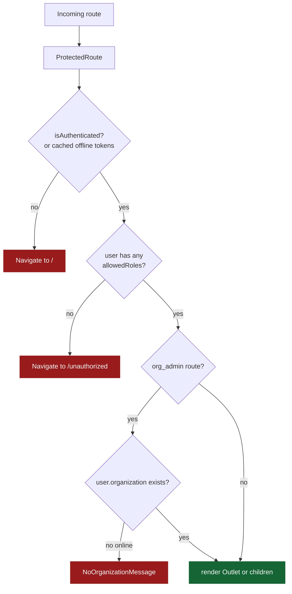

Role routing (see `routing.md` and `RBAC_AND_ROLES.md`):

| Path prefix | Allowed roles | Layout |
|---|---|---|
| `/admin/**` | `dgrv_admin` | AdminLayout |
| `/second-admin/**` | `org_admin` | SecondAdminLayout |
| `/third-admin/**` | `coop_admin` | ThirdAdminLayout |
| `/user/**` | `coop_user`, `coop_admin` | UserLayout |
| `/onboarding` | all four | — |
| `/`, `/unauthorized` | public | MainLayout |

### 3.4 Keycloak (Identity & Access Management)

- **Keycloak 26.3.1** with the `organization` **preview feature** enabled
  (`KC_FEATURES=preview,organization`).
- Realm: **`digital-gap`** (imported at boot from
  `infrastructure/keycloak/realm-export.json`, then post-configured by
  `scripts/keycloak-provisioning.sh` via `keycloak-startup.sh`).
- Three clients:
  - `dgat-client` (public) — used by the user PWA (Authorization Code + PKCE).
  - `dgat-admin-client` (confidential) — backend **service account** (`realm-admin`),
    used for Admin REST API calls (client-credentials grant).
  - `admin-portal` — admin portal (carries the `organization_id` session-note mapper).
- Token mappers: `cooperation` (Keycloak Group Membership, full path),
  `organizations` (Organization Role Mapper), `organization_id` (User Session Note),
  `assigned_dimensions` (custom user attribute). See `RBAC_AND_AUTH_SYSTEM.md` for
  claim details.
- SMTP configured from `KC_SPI_EMAIL_DEFAULT_*` env vars (email verification &
  organization invitations).

#### Authentication flow (OIDC Authorization Code + PKCE)

The PWA uses the standard OIDC Authorization Code flow with PKCE (S256). The user
authenticates against Keycloak (never against the backend), receives access/refresh/
id tokens, and stores them in IndexedDB via `idb-keyval`. From then on, every API
call attaches `Authorization: Bearer <jwt>`; the backend validates the JWT's RS256
signature against the cached JWKS and checks the issuer equals the public Keycloak
URL. Tokens are refreshed within 30s of expiry while online; offline, cached (even
expired) tokens are trusted so users can keep working. The sequence diagram below
covers the login → token exchange → API call → validation round trip.

```mermaid
sequenceDiagram
    participant U as User (PWA)
    participant KC as Keycloak
    participant BE as Backend (Axum)

    U->>KC: login redirect to /protocol/openid-connect/auth
    KC-->>U: authorization code
    U->>KC: token exchange code + PKCE verifier
    KC-->>U: access_token JWT + refresh_token + id_token
    U->>U: keycloak-js stores tokens in IndexedDB auth_tokens
    U->>BE: API request with Authorization Bearer jwt
    BE->>BE: auth_middleware validates JWT RS256 via JWKS
    BE->>BE: verify issuer equals public_url/realms/realm
    BE->>BE: inject Claims into request extensions
    BE-->>U: JSON response
    Note over U,BE: refresh within 30s of expiry; offline uses cached tokens
```

#### Keycloak bootstrapping & provisioning

Keycloak boots from a committed realm export (`infrastructure/keycloak/realm-export.json`)
loaded with `--import-realm`, then a startup script runs `keycloak-provisioning.sh`
which performs the one-time bootstrap: creating the first `dgrv_admin` user, granting
the backend service account `realm-admin`, configuring SMTP, fixing the realm's public
`frontendUrl`, restoring the client secret (the export masks it), and adding the
`organization`/`user_attributes` scopes to the public client. The sequence diagram
below is the exact order operations are performed on a fresh container.

```mermaid
sequenceDiagram
    participant DC as docker compose
    participant KC as Keycloak container
    participant KS as keycloak-startup.sh
    participant PR as keycloak-provisioning.sh
    participant DB as keycloak-db

    DC->>KC: start with --import-realm
    KC->>KC: load realm-export.json (non-destructive)
    KC->>DB: init schema
    KS->>KC: wait for port 8080 (retry loop)
    KS->>PR: run provisioning.sh
    PR->>KC: kcadm login (master/admin)
    PR->>KC: create bootstrap user 360@dgrv.coop (run-once marker)
    PR->>KC: set temp password; assign realm-management + dgrv_admin
    PR->>KC: assign realm-admin to dgat-admin-client service account
    PR->>KC: configure realm SMTP (KC_SPI_EMAIL_DEFAULT_*)
    PR->>KC: set realm frontendUrl (public HTTPS)
    PR->>KC: reset dgat-admin-client secret
    PR->>KC: add organization + user_attributes scopes to dgat-client
```

### 3.5 Object Storage (MinIO / S3)

- `S3StorageService` (`src/services/s3_storage.rs`) is the active backend, using the
  AWS SDK S3 client pointed at a MinIO endpoint with `force_path_style(true)`.
- Bucket `reports` (auto-created on backend startup). Report files stored under
  `reports/{id}/report.{ext}`.
- A legacy `MinioService` (`src/services/minio.rs`) implements the same
  `FileStorageService` trait but is **not wired** into `services/mod.rs` (dead code).
- See `MinIO_Integration.md` and the storage section of `FEATURES.md`.

#### Storage abstraction

Report files are kept in object storage (MinIO/S3), never in the database. The
backend defines a `FileStorageService` trait with two implementors: the **active**
`S3StorageService` (AWS SDK S3 client, `force_path_style` enabled for MinIO) and a
legacy `MinioService` (native `minio` crate) that is no longer wired in.
`ReportService` itself also implements the trait by delegating to its inner
`S3StorageService`, so it can be used interchangeably wherever a storage facade is
needed. The class diagram below shows this relationship and the key methods each
type exposes.

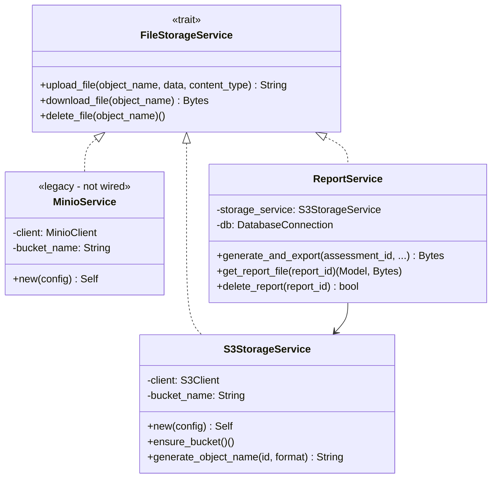

### 3.6 Databases

- Two separate PostgreSQL 16 instances (containers): **app DB** (`dgat`) and
  **Keycloak DB** (`keycloak`), on separate named volumes
  (`postgres-data`, `keycloak-db-data`).
- The app DB schema is managed by SeaORM migrations (`migration/`) run automatically
  on backend startup. See `DATABASE_SCHEMA.md` for the full schema.

#### Core data model (entity relationships)

The app DB is a relational schema of twelve tables centred on **dimensions**
(the assessment categories), which own maturity **current/desired states**,
**gaps**, and **recommendations**. An **assessment** records one cooperative's
self-evaluation; for each included dimension a **dimension_assessment** row selects
a current state and a desired state and stores the computed `gap_score`, plus a
one-to-one link to a **gap** record. Action plans and action items hang off the
assessment and the recommendations it drew from. **Organisation↔dimension**
assignments are tracked in `organisation_dimension` (by stable `dimension_key`, so
the assignment applies across all language variants). The ER diagram below is the
authoritative current relationship map — note that `gap_id` lives on
`dimension_assessments` (the relationship was inverted during development).

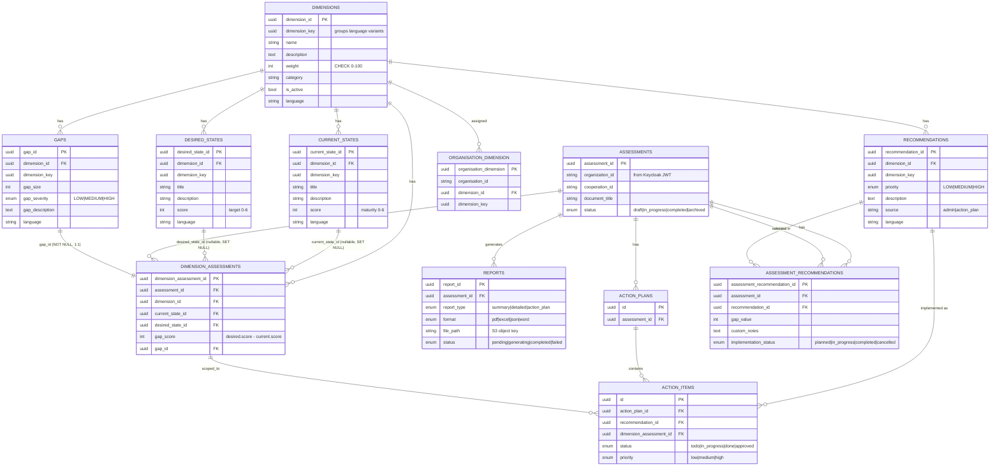

> Full column-level schema (types, nullability, indexes) is in `DATABASE_SCHEMA.md`.
> This ER diagram reflects the **current** schema (note: `gap_id` lives on
> `dimension_assessments`, not on `gaps`; the relationship was inverted during
> development).

## 4. Request / Data Flow

### 4.1 Typical authenticated request

This is the canonical request lifecycle, end to end, for an authenticated API call.
The browser first ensures it has a non-expired JWT by asking `keycloak-js` (refreshing
if needed), appends it as a `Bearer` header, and sends the request over HTTPS to the
host Nginx which terminates TLS and proxies into the backend. Inside the backend the
global auth middleware validates the token (RS256 via cached JWKS, issuer check),
injects `Claims`, and hands control to the handler → service → repository → Postgres
chain. The JSON response returned to the browser is cached by TanStack Query and
mirrored into Dexie so it's available offline next time. The sequence diagram below
walks through every hop.

```mermaid
sequenceDiagram
    participant U as Browser (PWA)
    participant K as keycloak-js
    participant HN as Host Nginx
    participant BE as Backend (Axum)
    participant MW as auth_middleware
    participant HD as Handler
    participant S as Service
    participant RE as Repository
    participant DB as PostgreSQL

    U->>K: getAccessToken, refresh if under 30s to expiry
    K-->>U: JWT bearer token
    U->>HN: GET /api path with Authorization Bearer jwt
    HN->>BE: proxy TLS terminated
    BE->>MW: request enters global middleware
    MW->>MW: validate token RS256 via cached JWKS
    MW->>MW: verify issuer equals public_url/realms/realm
    MW->>MW: inject Claims and raw token into req extensions
    MW->>HD: pass to handler
    HD->>S: service call
    S->>RE: repository query (SeaORM)
    RE->>DB: SQL
    DB-->>RE: rows
    RE-->>S: entity models
    S-->>HD: domain result
    HD-->>U: JSON response
    U->>U: TanStack Query caches; Dexie mirrors for offline
```

### 4.2 Assessment lifecycle (state machine)

An assessment progresses through a small set of statuses stored in the
`assessments.status` enum (`assessment_status_enum`). It is created as `Draft`,
moves to `in_progress` once the first dimension answer is saved, becomes `completed`
on submission, and may be `archived` by an admin at any point. The state machine
below documents the legal transitions and which API call triggers each one.

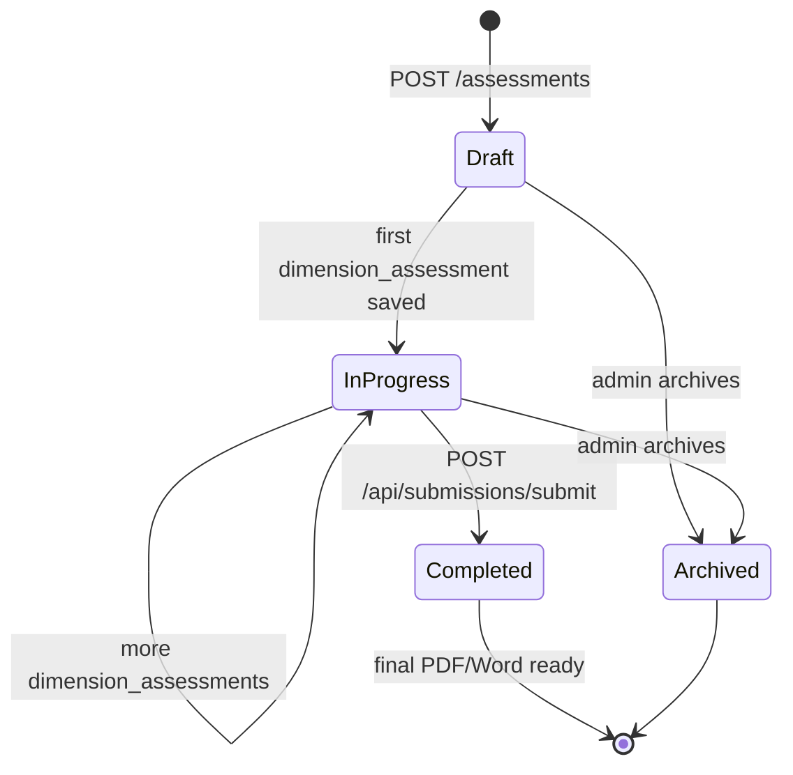

#### Assessment → submission → report generation (sequence)

This is the most important runtime flow in the product. While offline, the user's
dimension-assessment answers are written to IndexedDB and queued in `sync_queue`;
when connectivity returns the sync manager drains that queue into the backend
(`POST /assessments`, `POST /…/dimension-assessments`). Submitting the assessment
(`POST /api/submissions/submit`) flips its status to `Completed`, inserts a `Pending`
report row, and returns immediately — a **fire-and-forget `tokio::spawn`** then runs
PDF generation in the background (`fetch_report_data` → Tera render → headless Chrome
`print_to_pdf` → upload to MinIO → flip the report to `Completed`/`Failed`). The
user later downloads the file, which streams from MinIO. The sequence diagram below
covers the offline write path, the online sync, the submit-handoff, the background
generation, and the download.

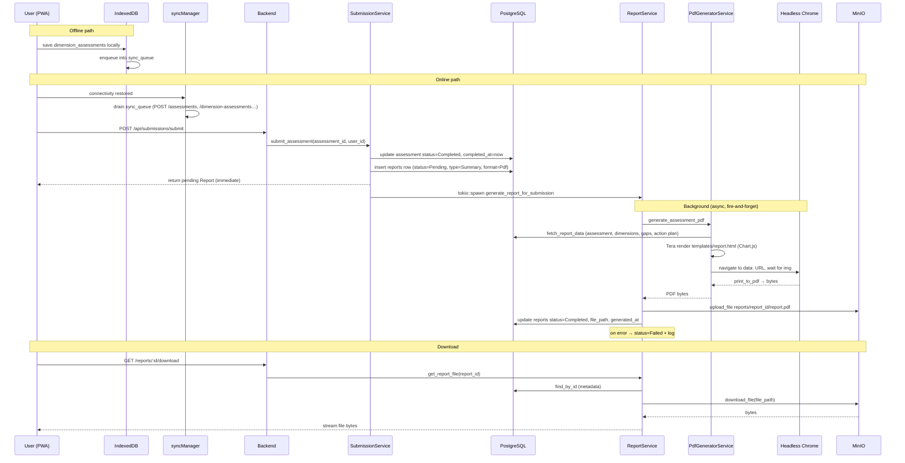

### 4.3 Reporting & export (PDF / Word generation pipeline)

On-demand report export regenerates the file fresh on every request rather than
re-serving a cached one. Both PDF and Word start from the same data prep —
`PdfGeneratorService::fetch_report_data` pulls the assessment, its dimension
assessments, dimensions, gaps, current/desired state scores, and the action plan's
items, and assembles a localized `PdfReportData` (labels in en/fr/pt/ss plus a
ChartData JSON blob). That data is rendered through `templates/report.html` (a
Chart.js bar chart). The two formats then diverge: PDF uses headless Chrome's
`print_to_pdf`; Word uses headless Chrome to capture the chart PNG, then `docx-rs`
builds a styled DOCX with the embedded chart. The generated bytes overwrite a
fixed MinIO object name per assessment and upsert the matching `reports` row. The
flowchart below shows the branch where PDF and Word diverge and rejoin at storage.

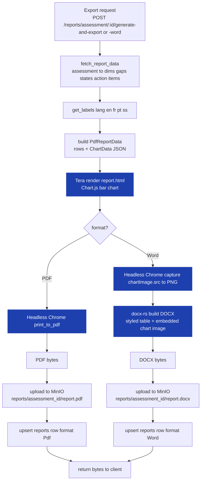

- On-demand export endpoints regenerate the file fresh each call:
  `POST /reports/assessment/:id/generate-and-export` (PDF) and
  `…/generate-and-export-word` (DOCX).
- Both reuse `PdfGeneratorService::fetch_report_data` to build a localized
  `PdfReportData`, render `templates/report.html` (Chart.js bar chart), and:
  - **PDF**: headless Chrome `print_to_pdf`.
  - **Word**: headless Chrome captures the chart PNG, then `docx-rs` builds a styled
    DOCX with an embedded chart image.
- Files overwrite a fixed object name per assessment (`reports/{assessment_id}/report.{ext}`)
  and upsert the matching `reports` row.

## 5. Offline-First Sync Architecture (Frontend)

The offline-first design is a defining architectural property, not an add-on. It lives
entirely in the frontend; the backend is a standard synchronous REST API.

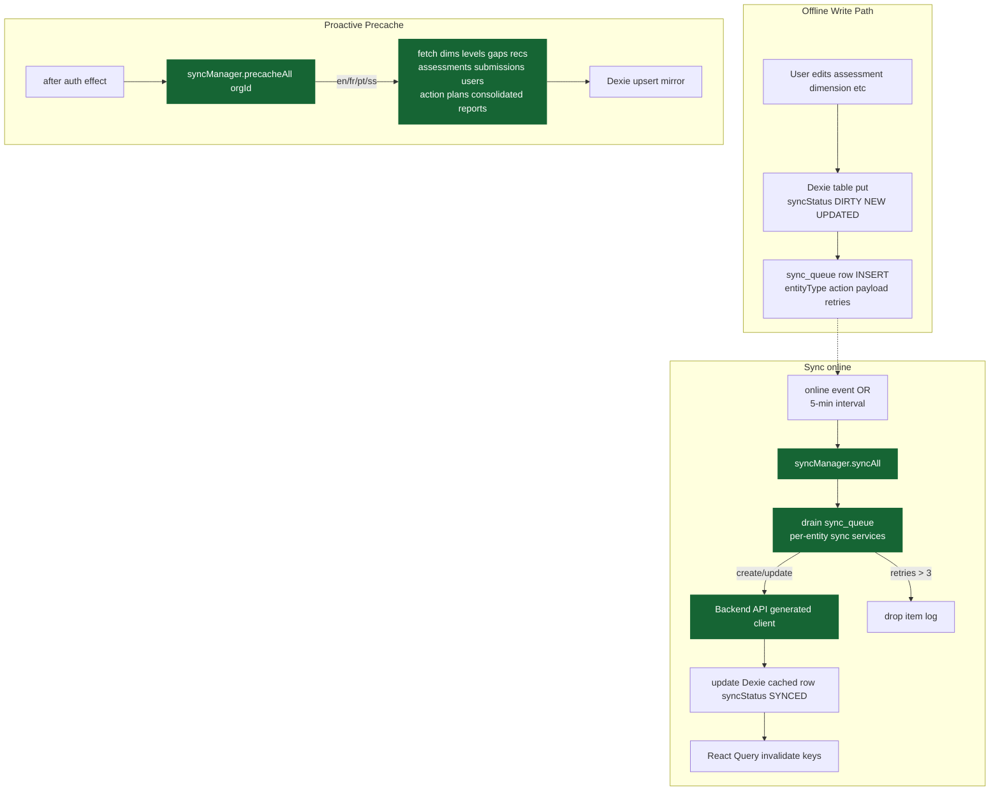

### Online/offline state model

The browser flips between two top-level connectivity states. While online, a
`handleOnline` callback runs `syncAll` + `precacheAll`; while offline, the user keeps
working against IndexedDB and trusted cached tokens (`ProtectedRoute` waits 3s for
auth to resolve, then trusts the cache). The state machine below documents these
transitions and the activities that fire on each.

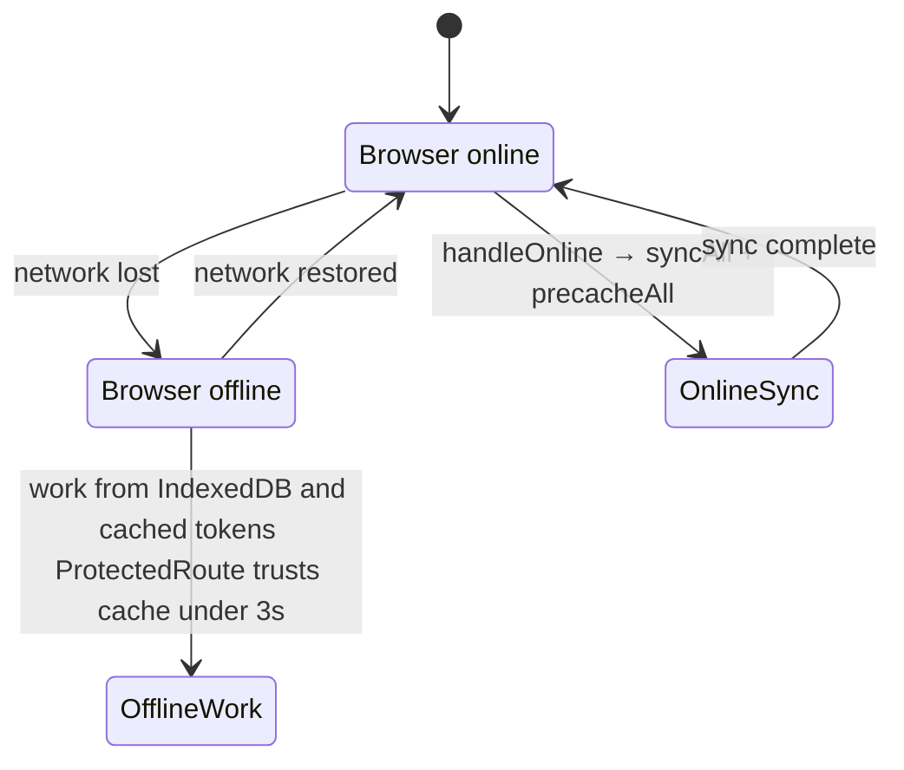

### Sync status enum (per entity row)

Every row cached in Dexie carries a `syncStatus` indicating its relationship to the
server. New offline edits move the row into `DIRTY`/`NEW`/`UPDATED`/`DELETED` and
enqueue a corresponding item in `sync_queue`. When the sync manager succeeds in
pushing the change, the row returns to `SYNCED`; if it fails three times the item is
dropped (and logged) and the row is marked `FAILED`. The diagram below shows how a
row progresses through these states.

```mermaid
graph LR
    SYNCED["SYNCED – matches server"] --> DIRTY["DIRTY – changed locally"]
    DIRTY --> NEW["NEW – created offline"]
    NEW --> UPDATED["UPDATED – edited offline"]
    UPDATED --> DELETED["DELETED – pending removal"]
    DELETED --> PENDING["PENDING – queued in sync_queue"]
    PENDING --> FAILED["FAILED – retries > 3, dropped"]

    classDef ok fill:#166534,color:#fff,stroke:none
    classDef warn fill:#854d0e,color:#fff,stroke:none
    classDef bad fill:#991b1b,color:#fff,stroke:none
    class SYNCED ok
    class FAILED bad
    class PENDING warn
```

## 6. Cross-Cutting Concerns

- **Configuration** — env-driven (`config.rs`, `envconfig`), loaded from `.env`.
  See `DEVELOPMENT.md` for the full env-var catalog.
- **Error handling** — `AppError` is the single error enum used across the backend
  (`src/error.rs`). Every variant implements `IntoResponse`, so handlers return
  `AppResult<T>` and Axum converts errors into a uniform `{ "error", "message" }`
  JSON body with the appropriate HTTP status. The flowchart below maps each
  `AppError` variant to the status code it produces. See `rust-error-handling.md`
  for the implementation.

```mermaid
flowchart LR
    E["AppError variant"] --> MAP{"IntoResponse"}
    MAP -->|"DatabaseError"| ISE["500 Internal Server Error"]
    MAP -->|"ValidationError"| BR["400 Bad Request"]
    MAP -->|"NotFound"| NF["404 Not Found"]
    MAP -->|"Unauthorized"| U["401 Unauthorized"]
    MAP -->|"BadRequest"| BR
    MAP -->|"AuthError"| U
    MAP -->|"FileStorageError"| ISE
    MAP -->|"Conflict"| C["409 Conflict"]
    MAP -->|"AnyhowError"| ISE
```

- **CORS** — `CorsLayer` allows `https://localhost`, `http://localhost:8000`,
  `http://0.0.0.0:3001`, credentials allowed, standard methods/headers.
- **OpenAPI** — the backend's API surface is documented via `utoipa` annotations on
  every handler and DTO, aggregated into a single `ApiDoc` and served at `/docs`
  (Swagger UI) and `/docs/openapi.json` (JSON). The spec is **validated at startup**
  (release builds panic on an invalid spec). The frontend regenerates its typed
  client from that JSON: `scripts/fetch_openapi.js` pulls it, then
  `npm run codegen` (openapi-ts) emits `src/openapi-client/`. The flow below traces
  this contract → client pipeline end to end.

```mermaid
flowchart LR
SRC["utoipa annotations<br/>on handlers and DTOs"] --> SPEC["ApiDoc openapi"]
    SPEC --> START["validates on startup<br/>panic in release if invalid"]
    SPEC --> SERVE["served at /docs + /docs/openapi.json"]
    SERVE --> FETCH["scripts/fetch_openapi.js<br/>or pull on startup"]
    FE --> GEN["npm run codegen<br/>openapi-ts"]
    GEN --> CLIENT["src/openapi-client/<br/>typed fetch client"]
    CLIENT --> APP["frontend app + tests"]
```

- **Migrations** — SeaORM migrator in `migration/`; applied automatically on boot.
- **Internationalization** — the product is localized at three distinct layers,
  shown in the diagram below: (1) the **UI** uses `i18next` with locale JSON files
  for en/fr/pt/ss; (2) the **report templates** are localized through
  `pdf_generator.rs::get_labels` (a Rust-side lookup for the same four languages);
  and (3) **DB content** (dimensions, current/desired states, gaps,
  recommendations) carries a `language` column grouped by a stable `dimension_key`
  so the same logical dimension can be served in any supported language. Importantly,
  `organisation_dimension` assignments are keyed by `dimension_key`, so assigning a
  dimension to an organisation applies across all its language variants. See
  `internationalization.md`.

```mermaid
flowchart LR
    subgraph UI["UI i18n"]
        L["i18next + LanguageDetector<br/>locales en fr pt ss json"]
    end
    subgraph Report["Report templates"]
        GL["pdf_generator.rs get_labels lang<br/>en fr pt ss"]
    end
    subgraph DB["DB content i18n"]
        DK["dimensions.dimension_key<br/>groups language variants"]
        DK --> CS["current_states.language"]
        DK --> DS["desired_states.language"]
        DK --> RC["recommendations.language"]
        DK --> GP["gaps.language"]
        DK --> OD["organisation_dimension.dimension_key<br/>assignment applies cross-language"]
    end
```

- **Observability** — `tracing`/`tracing-subscriber` structured logging to stdout;
  `RUST_LOG` configurable. No metrics/alerting pipeline implemented.

## 7. Design Decisions & Important Caveats

The mindmap below is the at-a-glance summary of the six design facts a new developer
**must** internalise before changing this codebase — each is expanded into a numbered
note beneath it. These are the non-obvious "gotchas" that distinguish the real
system from the aspirational `Arc42.md` design and from what the directory layout
might suggest.

```mermaid
mindmap
  root((DGAT Architecture))
    Monolith not microservices
      Single Axum binary
      Arc42 describes aspirational design
    AuthN strong / AuthZ weak
      Global JWT validation
      Only 3 invitation endpoints check dgrv_admin
      Frontend ProtectedRoute is primary role gate
      Recommendation add backend role guards
    Offline-first is central
      Dexie mirrors server data
      sync_queue drives writes
      ProtectedRoute trusts cached tokens
    Keycloak Organization model
      Organizations preview feature
      Groups for cooperatives
      groupId-coopName prefix convention
    Reporting needs headless browser
      Chromium in backend container
      PDF print_to_pdf
      Word capture chart PNG + docx-rs
    Schema/entity drift
      reports.minio_path in DB not entity
      states.level in DB not entity
      implementation_status text not enum type
```

1. **Monolith, not microservices.** Despite `Arc42.md` describing microservices +
   API gateway + CQRS, the actual backend is one Axum binary. Treat `Arc42.md` as a
   design-target document.
2. **AuthN strong, AuthZ weak.** The global middleware reliably validates JWTs, but
   application-level authorization is almost absent — only 3 invitation endpoints
   check `dgrv_admin`. Role enforcement is primarily done **client-side** via
   `ProtectedRoute`. See `RBAC_AND_ROLES.md` § "Security gaps" for the full picture.
3. **Offline-first is real and central.** Dexie mirrors server data; a `sync_queue`
  drives writes; `ProtectedRoute` trusts cached tokens when offline. This is a
  defining architectural property, not an add-on.
4. **Keycloak Organizations feature** is used for the org-tier, with Keycloak Groups
  for cooperatives. Group names carry a `{orgId}-{coopName}` prefix convention.
5. **Reporting depends on a headless browser** (Chromium) present in the backend
  container image (`infrastructure/Dockerfile.backend` installs `chromium`,
  `CHROME=/usr/bin/chromium`). Report generation will fail if Chromium is absent.
6. **Two schemas drift slightly from entities** (`minio_path` on reports, `level` on
  states exist in DB but aren't mapped) — see `DATABASE_SCHEMA.md` caveats.