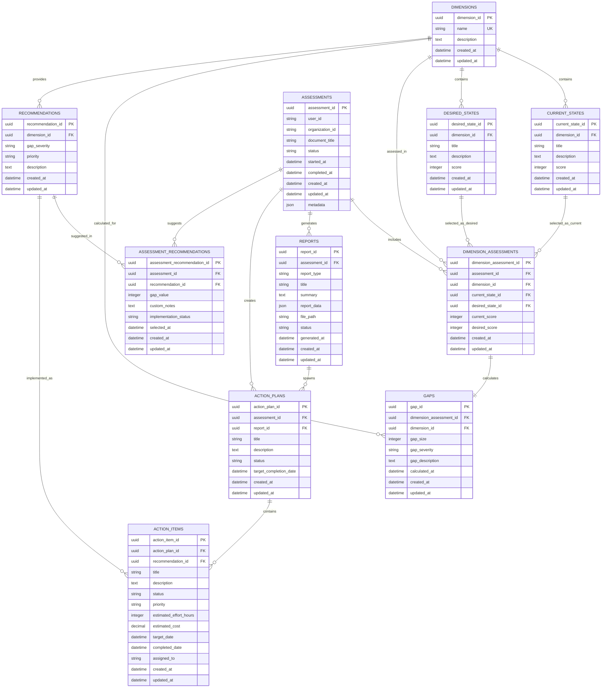

# Arc42 Architecture Documentation

## Digital Gap Analysis Tool (DGAT) for Cooperatives

## Table of Contents

1. [Introduction and Goals](#1-introduction-and-goals)
2. [Architecture Constraints](#2-architecture-constraints)
3. [System Scope and Context](#3-system-scope-and-context)
4. [Solution Strategy](#4-solution-strategy)
5. [Building Block View](#5-building-block-view)
6. [Runtime View](#6-runtime-view)
7. [Deployment View](#7-deployment-view)
8. [Cross-cutting Concepts](#8-cross-cutting-concepts)
9. [Design Decisions](#9-design-decisions)
10. [Quality Requirements](#10-quality-requirements)
11. [Risks and Technical Debts](#11-risks-and-technical-debts)
12. [Glossary](#12-glossary)

---

## 1. Introduction and Goals

### 1.1 Requirements Overview

The Digital Gap Analysis Tool (DGAT) is designed to support cooperatives in Southern Africa by providing a comprehensive digital maturity assessment platform. The tool transforms an existing Excel-based assessment into a modern, secure, and user-friendly Progressive Web Application (PWA).

**Key Business Goals:**
- Enable cooperatives to assess their current digital maturity
- Identify gaps between current and desired digital states
- Generate actionable strategies for digital transformation
- Provide offline-first functionality for regions with limited connectivity
- Support multiple languages relevant to Southern Africa

### 1.2 Quality Goals

| Priority | Quality Goal | Scenario |
|----------|-------------|----------|
| 1 | **Availability** | System must work offline and sync when connectivity returns |
| 2 | **Usability** | Intuitive interface accessible to users with varying technical skills |
| 3 | **Security** | Role-based access control with secure authentication |
| 4 | **Maintainability** | Modular architecture supporting future enhancements |
| 5 | **Performance** | Fast load times and responsive user interactions |

### 1.3 Stakeholders

| Role | Contact | Expectations |
|------|---------|-------------|
| **DGRV Staff** | Project Sponsors | Effective tool for supporting cooperative development |
| **Cooperative Members** | End Users | Easy-to-use assessment tool with actionable insights |
| **System Administrators** | IT Operations | Reliable, secure, and maintainable system |
| **Development Team** | adorsys | Scalable architecture with modern technology stack |

---

## 2. Architecture Constraints

### 2.1 Technical Constraints

| Constraint | Description | Impact |
|------------|-------------|---------|
| **Technology Stack** | Must use Rust backend, React frontend, PostgreSQL database | Defines implementation approach |
| **Progressive Web App** | Must function as PWA with offline capabilities | Requires service worker implementation |
| **Cloud Infrastructure** | Deployment on AWS using Kubernetes | Influences deployment and scaling strategies |
| **Authentication** | Must use Keycloak for IAM | Defines security architecture |

### 2.2 Organizational Constraints

- Project timeline and budget constraints
- Compliance with data protection regulations (GDPR, local regulations)
- Multilingual support requirements
- Support for existing Excel-based workflow during transition

### 2.3 Conventions

- RESTful API design principles
- React component-based architecture
- Rust microservices pattern
- Kubernetes deployment standards
- Security-first design approach

---

## 3. System Scope and Context

### 3.1 Business Context

```
┌─────────────────┐    ┌──────────────────────┐    ┌─────────────────┐
│   Cooperatives  │◄──►│       DGAT           │◄──►│   DGRV Staff    │
│   (End Users)   │    │   (System)           │    │   (Admins)      │
└─────────────────┘    └──────────────────────┘    └─────────────────┘
                                │
                                ▼
                       ┌─────────────────┐
                       │  Reporting &    │
                       │  Analytics      │
                       └─────────────────┘
```

**External Interfaces:**

| Entity | Input | Output |
|--------|-------|--------|
| **Cooperatives** | Assessment data, organization info | Reports, action plans, recommendations |
| **DGRV Staff** | Configuration, user management | System analytics, aggregate reports |
| **External Systems** | Sync data (future) | Integration APIs (future) |

### 3.2 Technical Context

```
┌─────────────────────────────────────────────────────────────────┐
│                        Internet/Cloud                           │
│  ┌─────────────────┐  ┌─────────────────┐  ┌─────────────────┐ │
│  │   Web Browsers  │  │   Mobile Apps   │  │   Admin Portal  │ │
│  └─────────────────┘  └─────────────────┘  └─────────────────┘ │
└─────────────────────────────────────────────────────────────────┘
                               │
                               ▼
┌─────────────────────────────────────────────────────────────────┐
│                     AWS Kubernetes Cluster                     │
│                                                                 │
│  ┌─────────────┐  ┌─────────────┐  ┌─────────────┐            │
│  │   React     │  │    Rust     │  │  PostgreSQL │            │
│  │    PWA      │  │ Microservices│  │  Database   │            │
│  └─────────────┘  └─────────────┘  └─────────────┘            │
│                                                                 │
│  ┌─────────────────────────────────────────────────────────┐   │
│  │              Keycloak (Authentication)                  │   │
│  └─────────────────────────────────────────────────────────┘   │
└─────────────────────────────────────────────────────────────────┘
```

---

## 4. Solution Strategy

### 4.1 Technology Decisions

| Decision | Rationale |
|----------|-----------|
| **Rust Backend** | Memory safety, performance, concurrent handling |
| **React PWA** | Offline capabilities, cross-platform compatibility |
| **PostgreSQL** | ACID compliance, JSON support, mature ecosystem |
| **Keycloak** | Enterprise-grade authentication, role management |
| **Kubernetes** | Scalability, container orchestration, cloud-native |

### 4.2 Top-level Decomposition

The system follows a microservices architecture with clear separation of concerns:

- **Frontend Layer**: React PWA for user interactions
- **API Gateway**: Request routing and authentication
- **Business Logic Layer**: Rust microservices for core functionality
- **Data Layer**: PostgreSQL for persistent storage
- **Authentication Layer**: Keycloak for identity management

### 4.3 Achieving Quality Goals

| Quality Goal | Solution Approach |
|--------------|-------------------|
| **Offline Capability** | Service workers, local storage, data synchronization |
| **Security** | JWT tokens, role-based access, encrypted communication |
| **Usability** | Responsive design, progressive disclosure, multilingual UI |
| **Performance** | Microservices, caching, optimized queries |
| **Scalability** | Kubernetes horizontal scaling, stateless services |

---

## 5. Building Block View

### 5.1 Whitebox Overall System

```
┌─────────────────────────────────────────────────────────────────┐
│                        DGAT System                              │
│                                                                 │
│  ┌─────────────────────────────────────────────────────────┐   │
│  │                   Frontend Layer                        │   │
│  │  ┌─────────────┐  ┌─────────────┐  ┌─────────────────┐  │   │
│  │  │  User PWA   │  │  Admin Web  │  │  Service Worker │  │   │
│  │  └─────────────┘  └─────────────┘  └─────────────────┘  │   │
│  └─────────────────────────────────────────────────────────┘   │
│                               │                                 │
│                               ▼                                 │
│  ┌─────────────────────────────────────────────────────────┐   │
│  │                   API Gateway                           │   │
│  │  ┌─────────────────────────────────────────────────────┐│   │
│  │  │           Authentication & Authorization            ││   │
│  │  └─────────────────────────────────────────────────────┘│   │
│  └─────────────────────────────────────────────────────────┘   │
│                               │                                 │
│                               ▼                                 │
│  ┌─────────────────────────────────────────────────────────┐   │
│  │                 Business Logic Layer                   │   │
│  │  ┌─────────────┐  ┌─────────────┐  ┌─────────────────┐  │   │
│  │  │ Assessment  │  │ User Mgmt   │  │   Reporting     │  │   │
│  │  │  Service    │  │  Service    │  │   Service       │  │   │
│  │  └─────────────┘  └─────────────┘  └─────────────────┘  │   │
│  └─────────────────────────────────────────────────────────┘   │
│                               │                                 │
│                               ▼                                 │
│  ┌─────────────────────────────────────────────────────────┐   │
│  │                    Data Layer                           │   │
│  │  ┌─────────────────┐  ┌─────────────────────────────────┐│   │
│  │  │   PostgreSQL    │  │        File Storage           ││   │
│  │  │    Database     │  │   (MinIO/S3 + Reports)        ││   │
│  │  │  (Metadata)     │  │     (Large Files)             ││   │
│  │  └─────────────────┘  └─────────────────────────────────┘│   │
│  └─────────────────────────────────────────────────────────┘   │
└─────────────────────────────────────────────────────────────────┘
```

### 5.2 Level 2 - Frontend Layer

**User PWA Components:**
- Assessment Wizard
- Dashboard
- Reports Viewer
- Offline Data Manager
- Settings & Profile

**Admin Web Components:**
- User Management
- Organization Management
- System Configuration
- Analytics Dashboard

### 5.3 Level 2 - Business Logic Layer

**Assessment Service:**
- Digital maturity assessment logic
- Gap analysis calculations
- Recommendation generation
- Data validation

**User Management Service:**
- User profile management
- Organization management
- Role assignment
- Activity tracking

**Reporting Service:**
- Report generation (PDF, Excel, JSON)
- File storage management (MinIO/S3)
- Template management
- Export functionality
- Analytics aggregation
- Dual storage orchestration

---

## 6. Runtime View

### 6.1 Assessment Workflow

```
User         PWA          API Gateway    Assessment    Database
│             │                │           Service       │
│ Start       │                │              │          │
│Assessment   │                │              │          │
├─────────────►                │              │          │
│             │ Authenticate   │              │          │
│             ├────────────────►              │          │
│             │ JWT Token      │              │          │
│             ◄────────────────┤              │          │
│             │                │              │          │
│             │ Submit Data    │              │          │
│             ├────────────────┼──────────────►          │
│             │                │ Store Data   │          │
│             │                │              ├──────────►
│             │                │              │          │
│             │                │ Calculate    │          │
│             │                │ Gaps         │          │
│             │                │◄─────────────┤          │
│             │ Return Results │              │          │
│             ◄────────────────┼──────────────┤          │
│             │                │              │          │
```

### 6.2 Offline Synchronization

```
PWA          Service       API Gateway    Backend
│            Worker           │           Services
│               │             │               │
│ Offline       │             │               │
│ Actions       │             │               │
├───────────────►             │               │
│               │ Store Local │               │
│               │ Changes     │               │
│               │             │               │
│ Connection    │             │               │
│ Restored      │             │               │
├───────────────►             │               │
│               │ Sync Data   │               │
│               ├─────────────┼───────────────►
│               │             │ Process       │
│               │             │ Changes       │
│               │◄────────────┼───────────────┤
│               │             │               │
```

### 6.3 Report Generation with Dual Storage

**Scenario:** User requests a PDF report generation

```
┌─────────────┐    ┌─────────────┐    ┌─────────────┐    ┌─────────────┐
│   Client    │    │   API       │    │  Report     │    │ PostgreSQL  │
│  Request    │    │ Gateway     │    │ Service     │    │ Database    │
└─────────────┘    └─────────────┘    └─────────────┘    └─────────────┘
       │                   │                   │                   │
       │ 1. POST /reports  │                   │                   │
       ├──────────────────►│                   │                   │
       │                   │ 2. Forward       │                   │
       │                   ├──────────────────►│                   │
       │                   │                   │ 3. Create record │
       │                   │                   ├──────────────────►│
       │                   │                   │ 4. Record created│
       │                   │                   │◄──────────────────┤
       │                   │                   │ 5. Generate file │
       │                   │                   ├──────────────────►│
       │                   │                   │                   │
       │                   │                   │ 6. Upload to     │
       │                   │                   │    MinIO/S3      │
       │                   │                   ├──────────────────►│
       │                   │                   │                   │
       │                   │                   │ 7. Update path   │
       │                   │                   ├──────────────────►│
       │                   │                   │ 8. Report ready  │
       │                   │                   │◄──────────────────┤
       │                   │ 9. Report URL     │                   │
       │                   │◄──────────────────┤                   │
       │ 10. Report URL    │                   │                   │
       │◄──────────────────┤                   │                   │
```

**Storage Flow:**
1. **Database**: Store report metadata (title, format, status)
2. **File Storage**: Upload generated file to MinIO/S3
3. **Database**: Update record with storage path
4. **Client**: Receive download URL for file access

---

## 7. Deployment View

### 7.1 Production Environment

```
┌─────────────────────────────────────────────────────────────────┐
│                        AWS Cloud                               │
│                                                                 │
│  ┌─────────────────────────────────────────────────────────┐   │
│  │                  Kubernetes Cluster                     │   │
│  │                                                         │   │
│  │  ┌─────────────┐  ┌─────────────┐  ┌─────────────────┐  │   │
│  │  │  Frontend   │  │    API      │  │   Keycloak      │  │   │
│  │  │    Pods     │  │  Gateway    │  │     Pod         │  │   │
│  │  └─────────────┘  └─────────────┘  └─────────────────┘  │   │
│  │                                                         │   │
│  │  ┌─────────────┐  ┌─────────────┐  ┌─────────────────┐  │   │
│  │  │ Assessment  │  │User Service │  │  Reporting      │  │   │
│  │  │  Service    │  │    Pod      │  │   Service       │  │   │
│  │  └─────────────┘  └─────────────┘  └─────────────────┘  │   │
│  │                                                         │   │
│  │  ┌─────────────────────────────────────────────────────┐│   │
│  │  │              PostgreSQL StatefulSet                ││   │
│  │  └─────────────────────────────────────────────────────┘│   │
│  │                                                         │   │
│  │  ┌─────────────────────────────────────────────────────┐│   │
│  │  │                MinIO StatefulSet                   ││   │
│  │  │            (File Storage Service)                  ││   │
│  │  └─────────────────────────────────────────────────────┘│   │
│  └─────────────────────────────────────────────────────────┘   │
│                                                                 │
│  ┌─────────────────────────────────────────────────────────┐   │
│  │                    Load Balancer                        │   │
│  └─────────────────────────────────────────────────────────┘   │
└─────────────────────────────────────────────────────────────────┘
```

### 7.2 Infrastructure Components

| Component | Technology | Scaling | Purpose |
|-----------|------------|---------|---------|
| **Load Balancer** | AWS ALB | Auto | Traffic distribution |
| **API Gateway** | Custom/Nginx | Horizontal | Request routing |
| **Frontend** | React PWA | Horizontal | User interface |
| **Backend Services** | Rust microservices | Horizontal | Business logic |
| **Database** | PostgreSQL | Vertical | Data persistence |
| **Authentication** | Keycloak | Horizontal | Identity management |

---

## 8. Cross-cutting Concepts

### 8.1 Security Concept

**Authentication & Authorization:**
- JWT-based authentication via Keycloak
- Role-based access control (RBAC)
- API endpoint protection
- Secure session management

**Data Protection:**
- Encryption in transit (TLS)
- Encryption at rest (database level)
- Data anonymization for reports
- GDPR compliance measures

### 8.2 Offline-First Architecture

**Data Synchronization:**
- Optimistic updates with conflict resolution
- Event-driven synchronization
- Incremental sync to minimize bandwidth
- Conflict detection and resolution strategies

**Local Storage:**
- IndexedDB for structured data
- LocalStorage for user preferences
- Service Worker caching for resources
- Data compression for efficiency

### 8.3 Internationalization

**Multi-language Support:**
- Resource bundles for UI text
- Right-to-left language support
- Date/time localization
- Currency and number formatting
- Cultural considerations for UI/UX

### 8.4 Error Handling & Logging

**Error Management:**
- Centralized error handling
- User-friendly error messages
- Automatic error reporting
- Graceful degradation

**Logging Strategy:**
- Structured logging (JSON format)
- Log levels (DEBUG, INFO, WARN, ERROR)
- Performance metrics
- Audit trails for compliance

---

## 9. Design Decisions

### 9.1 Technology Choices

| Decision | Alternatives Considered | Rationale |
|----------|------------------------|-----------|
| **Rust Backend** | Java, .NET, Node.js | Performance, memory safety, concurrency |
| **React PWA** | Angular, Vue.js | Ecosystem maturity, PWA support |
| **PostgreSQL** | MongoDB, MySQL | ACID compliance, JSON support |
| **Microservices** | Monolith | Scalability, team independence |

### 9.2 Architectural Patterns

**Event-Driven Architecture:**
- Asynchronous communication between services
- Event sourcing for audit trails
- CQRS for read/write optimization

**Repository Pattern:**
- Data access abstraction
- Testability improvements
- Technology independence

### 9.3 Data Management

**Database Design:**
- Simplified schema with single STATES table for both current and desired states
- Predefined maturity levels per dimension (score-based 1-5 scale)
- Direct state selection without redundant junction tables
- JSON fields for flexible metadata and gap descriptions
- Audit tables for change tracking

### 9.4 Entity Relationship Diagram



### 9.5 Database Schema

The DGAT system uses a PostgreSQL database with the following schema structure:

### 9.6 Dual Storage Architecture

The DGAT system implements a **hybrid storage architecture** that separates structured data from file storage for optimal performance and scalability.

#### 9.6.1 Storage Strategy

| Storage Type | Technology | Purpose | Data Types |
|--------------|------------|---------|------------|
| **Primary Database** | PostgreSQL | Metadata, structured data, relationships | Assessment data, user info, configurations |
| **File Storage** | MinIO/S3 | Large files, reports, documents | PDF reports, Excel files, JSON exports |

#### 9.6.2 File Storage Implementation

**Dual Service Architecture:**
- **MinioService**: Native MinIO client for direct MinIO integration
- **S3StorageService**: AWS S3 SDK for S3-compatible storage
- **FileStorageService Trait**: Common interface for both implementations

```rust
#[async_trait]
pub trait FileStorageService: Send + Sync {
    async fn upload_file(&self, object_name: &str, data: Bytes, content_type: &str) -> Result<String, AppError>;
    async fn download_file(&self, object_name: &str) -> Result<Bytes, AppError>;
    async fn delete_file(&self, object_name: &str) -> Result<(), AppError>;
}
```

#### 9.6.3 Reports Table - Storage Bridge

The `reports` table serves as the bridge between database metadata and file storage:

```sql
CREATE TABLE reports (
    report_id UUID PRIMARY KEY,
    assessment_id UUID NOT NULL,
    report_type VARCHAR NOT NULL,        -- summary, detailed, action_plan
    title VARCHAR NOT NULL,
    format VARCHAR NOT NULL,             -- pdf, excel, json
    summary TEXT,
    report_data JSONB,                   -- Small metadata (optional)
    file_path VARCHAR,                   -- Legacy file path (optional)
    minio_path VARCHAR,                  -- MinIO storage path
    status VARCHAR NOT NULL,             -- pending, generating, completed, failed
    generated_at TIMESTAMP NOT NULL,
    created_at TIMESTAMP NOT NULL,
    updated_at TIMESTAMP NOT NULL
);
```

**Key Integration Fields:**
- `minio_path`: Full path to file in MinIO (e.g., `"reports/uuid/report.pdf"`)
- `file_path`: Legacy field for backward compatibility
- `report_data`: Optional JSON metadata for small data

#### 9.6.4 File Storage Workflow


#### 9.6.5 Object Naming Convention

Files are organized using a hierarchical naming structure:
```
reports/{report_id}/report.{format}
```

**Examples:**
- `reports/550e8400-e29b-41d4-a716-446655440000/report.pdf`
- `reports/550e8400-e29b-41d4-a716-446655440000/report.xlsx`
- `reports/550e8400-e29b-41d4-a716-446655440000/report.json`

#### 9.6.6 Supported File Formats

| Format | Extension | Content Type | Use Case |
|--------|-----------|--------------|----------|
| **PDF** | `.pdf` | `application/pdf` | Final reports for stakeholders |
| **Excel** | `.xlsx` | `application/vnd.openxmlformats-officedocument.spreadsheetml.sheet` | Data analysis, spreadsheets |
| **JSON** | `.json` | `application/json` | API responses, data exchange |

#### 9.6.7 Configuration

**MinIO Configuration:**
```rust
pub struct MinioConfig {
    pub endpoint: String,        // MinIO server URL
    pub access_key: String,      // Access credentials
    pub secret_key: String,      // Secret credentials  
    pub bucket_name: String,     // Storage bucket name
    pub use_ssl: bool,          // SSL/TLS encryption
}
```

**Environment Variables:**
- `DGAT_MINIO_ENDPOINT`: MinIO server endpoint
- `DGAT_MINIO_ACCESS_KEY`: Access key for authentication
- `DGAT_MINIO_SECRET_KEY`: Secret key for authentication
- `DGAT_MINIO_BUCKET_NAME`: Default bucket name
- `DGAT_MINIO_USE_SSL`: Enable SSL/TLS encryption

#### 9.6.8 ReportService Orchestration

The `ReportService` coordinates between database and file storage:

**Key Operations:**
1. **`generate_and_store_report()`**: Creates DB record + uploads file
2. **`get_report_file()`**: Retrieves metadata + downloads file
3. **`delete_report()`**: Deletes file + removes DB record

**Data Consistency:**
- Atomic operations ensure database and file storage remain synchronized
- Failed uploads don't create orphaned database records
- Path validation prevents invalid storage operations
- Status tracking reflects file availability

#### 9.6.9 Benefits of Dual Storage

| Benefit | Description |
|---------|-------------|
| **Scalability** | Large files don't bloat the database |
| **Performance** | Database queries remain fast |
| **Flexibility** | Can switch between MinIO and S3 |
| **Cost Efficiency** | Object storage is cheaper than database storage |
| **Backup & Recovery** | Files can be backed up independently |
| **CDN Integration** | Files can be served via CDN for better performance |

#### 9.6.10 Storage Architecture Diagram


---

## 10. Quality Requirements

### 10.1 Performance Requirements

| Requirement | Measurement | Target |
|-------------|-------------|---------|
| **Response Time** | API response time | < 200ms for 95th percentile |
| **Load Time** | PWA initial load | < 3 seconds on 3G connection |
| **Throughput** | Concurrent users | Support 1000+ concurrent assessments |
| **Offline Performance** | Local operations | < 100ms response time |

### 10.2 Availability Requirements

- **Uptime:** 99.9% availability (8.77 hours downtime/year)
- **Recovery:** RTO < 4 hours, RPO < 1 hour
- **Offline Capability:** Full functionality without internet
- **Data Sync:** Automatic synchronization when online

### 10.3 Security Requirements

- **Authentication:** Multi-factor authentication support
- **Authorization:** Role-based access control
- **Data Privacy:** GDPR compliance
- **Audit Trail:** Complete user action logging

### 10.4 Usability Requirements

- **Accessibility:** WCAG 2.1 AA compliance
- **Mobile Support:** Responsive design for all devices
- **Intuitive Interface:** < 30 minutes training for basic usage
- **Multi-language:** Support for English, Portuguese, and local languages

---

## 11. Risks and Technical Debts

### 11.1 Technical Risks

| Risk | Probability | Impact | Mitigation Strategy |
|------|-------------|--------|-------------------|
| **Offline Sync Conflicts** | Medium | High | Robust conflict resolution algorithms |
| **Performance Degradation** | Low | High | Performance monitoring and optimization |
| **Security Vulnerabilities** | Medium | Critical | Regular security audits and updates |
| **Data Migration Issues** | Low | Medium | Comprehensive testing and rollback plans |

### 11.2 Organizational Risks

- **User Adoption:** Resistance to change from Excel-based workflow
- **Training Requirements:** Need for user training programs
- **Connectivity Issues:** Limited internet in target regions
- **Maintenance Resources:** Ongoing support and maintenance needs

### 11.3 Technical Debt

- **MVP Compromises:** Some advanced features deferred to future releases
- **Testing Coverage:** Areas requiring more comprehensive testing
- **Documentation:** Need for more detailed API documentation
- **Performance Optimization:** Opportunities for further optimization

---

## 12. Glossary

| Term | Definition |
|------|------------|
| **DGAT** | Digital Gap Analysis Tool - the main system |
| **DGRV** | Deutscher Genossenschafts- und Raiffeisenverband e.V. - German cooperative organization |
| **PWA** | Progressive Web App - web application with native app features |
| **Digital Maturity** | Level of digital adoption and capability within an organization |
| **Gap Analysis** | Process of comparing current state with desired future state |
| **Cooperative** | Member-owned business organization |
| **Microservices** | Architectural style with loosely coupled services |
| **JWT** | JSON Web Token - secure token format for authentication |
| **RBAC** | Role-Based Access Control - authorization method |
| **Service Worker** | JavaScript that runs in background for offline functionality |
| **IndexedDB** | Browser database for storing large amounts of structured data |
| **CQRS** | Command Query Responsibility Segregation - architectural pattern |
| **Event Sourcing** | Storing data as a sequence of events |
| **GDPR** | General Data Protection Regulation - EU privacy law |
| **WCAG** | Web Content Accessibility Guidelines - accessibility standards |

---