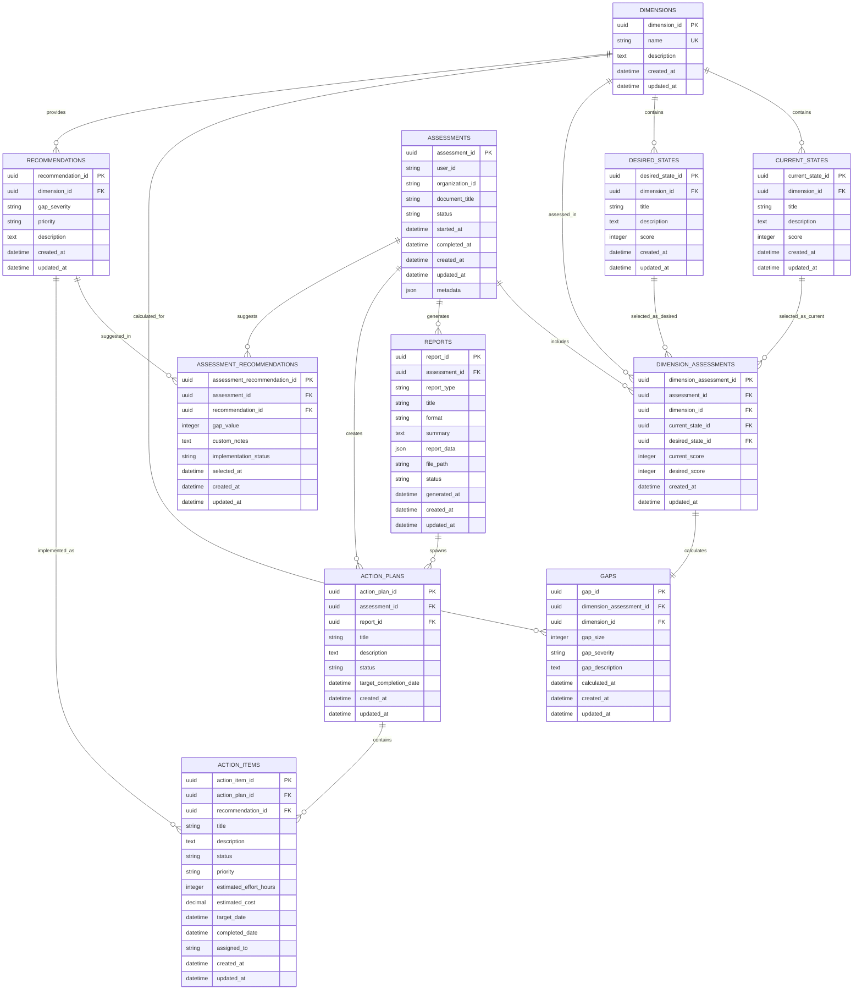

# Database ER Diagram - Digital Gap Analysis Tool (DGAT)

## Entity Relationship Diagram



## Entity Descriptions

### Core Entities

#### DIMENSIONS
- **Purpose**: Define assessment categories (Technology, Social, etc.)
- **Key Fields**:
  - `dimension_id`: Primary identifier
  - `code`: Short unique identifier
  - `name`: Display name
  - `category`: Grouping mechanism

#### CURRENT_STATES
- **Purpose**: Define current maturity levels within each dimension (0-6 scale)
- **Key Fields**:
  - `current_state_id`: Primary identifier  
  - `dimension_id`: Links to parent dimension
  - `score`: Numerical score (0-6)
  - `title`: Short descriptive name (e.g., "Basic minimal Adoption")
  - `description`: Detailed explanation of this maturity level

#### DESIRED_STATES
- **Purpose**: Define desired/target maturity levels within each dimension (0-6 scale)
- **Key Fields**:
  - `desired_state_id`: Primary identifier  
  - `dimension_id`: Links to parent dimension
  - `score`: Numerical score (0-6)
  - `title`: Short descriptive name (e.g., "Encouraging Digital Adoption")
  - `description`: Detailed explanation of this maturity level

### Assessment Entities

#### ASSESSMENTS
- **Purpose**: Track individual assessment sessions
- **Key Fields**:
  - `assessment_id`: Primary identifier
  - `user_id`: Keycloak user identifier from JWT token
  - `organization_id`: Keycloak organization identifier from JWT token
  - `document_title`: Title from metadata (e.g., "Digital Gap Analysis Matrix DGRV")
  - `file_name`: Original file name if imported
  - `status`: Current state (draft, in_progress, completed)

#### DIMENSION_ASSESSMENTS
- **Purpose**: Store user selections for current and desired states per dimension
- **Key Fields**:
  - `assessment_id`: Links to parent assessment
  - `dimension_id`: Which dimension is being assessed (e.g., "Digital Culture")
  - `current_state_id/desired_state_id`: Selected current and desired states
  - `current_score/desired_score`: Numerical scores (0-6) for gap calculation

#### GAPS
- **Purpose**: Store calculated analysis between current and desired states
- **Key Fields**:
  - `gap_size`: Numerical difference (desired_score - current_score)
  - `gap_severity`: Categorical level (LOW, MEDIUM, HIGH)
  - `gap_description`: Detailed explanation of the gap

### Recommendation & Action Entities

#### RECOMMENDATIONS
- **Purpose**: Predefined template suggestions for specific dimensions and gap severities
- **Key Fields**:
  - `dimension_id`: Which dimension this applies to (e.g., "Digital Culture")
  - `gap_severity`: When to show this recommendation (LOW, MEDIUM, HIGH)
  - `priority`: Urgency level (URGENT, HIGH, MEDIUM, LOW)
  - `description`: Specific action recommendation
  - **Example**: "For Digital Culture dimension, HIGH severity gaps, priority URGENT: Implement Digital Literacy Training Programs"

#### ASSESSMENT_RECOMMENDATIONS
- **Purpose**: Track which recommendations were suggested and selected for each assessment
- **Key Fields**:
  - `assessment_id`: Which assessment this belongs to
  - `recommendation_id`: Which template recommendation was suggested
  - `gap_value`: The actual gap value that triggered this recommendation
  - `implementation_status`: Progress tracking (planned, in_progress, completed)

#### REPORTS
- **Purpose**: Store generated assessment reports
- **Key Fields**:
  - `report_type`: Summary, detailed, action_plan
  - `report_data`: JSON structure with report content
  - `file_path`: Location of generated document

#### ACTION_PLANS & ACTION_ITEMS
- **Purpose**: Track implementation of recommendations
- **Key Fields**:
  - Action plans contain multiple action items
  - Progress tracking and assignment capabilities

## Key Design Decisions

### 1. Flexible State System
- Current and desired states are separate with independent 0-6 levels per dimension
- Allows for easy addition of new dimensions and state definitions
- Supports localization through description fields

### 2. Gap Calculation & Analysis
- Gaps are calculated and stored (desired_level - current_level)
- Supports positive gaps (improvement needed), negative gaps (reduction desired), and zero gaps (no change)
- Enables historical tracking and trend analysis

### 3. Smart Recommendation Engine
- **Template-based**: Recommendations are predefined templates for specific dimension + gap range combinations
- **Auto-matching**: System automatically finds applicable recommendations based on calculated gaps
- **User Selection**: Users can choose which recommended actions to pursue
- **Example Flow**: 
  - Gap calculated: Technology dimension, +3 improvement needed
  - System finds: All recommendations for Technology dimension where min_gap_value ≤ 3 ≤ max_gap_value
  - User selects: Which recommendations to implement

### 4. Audit Trail
- All entities include created_at/updated_at timestamps
- Assessment history is preserved
- Enables compliance and progress tracking

### 5. Multi-tenancy Support
- Organization-based data separation through Keycloak JWT tokens
- User identity verified through Keycloak authentication
- Assessments are scoped to organizations via JWT claims

## Sample Data Flow

1. **User Authentication**: User authenticates via Keycloak, receives JWT with user and organization claims
2. **Assessment Creation**: Authenticated user starts a new Assessment with metadata (document title, file name)
3. **Dimension Analysis**: For each dimension (e.g., "Digital Culture"):
   - **Current State Selection**: User selects current state with score and description
   - **Desired State Selection**: User selects desired state with score and title
4. **Gap Analysis**: System calculates:
   - `gap_size`: desired_score - current_score
   - `gap_severity`: LOW/MEDIUM/HIGH based on gap size
   - `gap_description`: Contextual explanation
5. **Recommendation Matching**: System finds recommendations based on:
   - Dimension match
   - Gap severity match
   - Gap size within min/max range
6. **Recommendation Selection**: User reviews recommendations with priorities (URGENT, HIGH, etc.)
7. **Report Generation**: System creates comprehensive reports with all dimension analyses
8. **Action Planning**: User can create Action Plans with specific Action Items based on selected recommendations

## Indexing Strategy

```sql
-- Primary performance indexes
CREATE INDEX idx_dimension_assessments_assessment_id ON dimension_assessments(assessment_id);
CREATE INDEX idx_gaps_dimension_assessment_id ON gaps(dimension_assessment_id);
CREATE INDEX idx_gaps_dimension_severity ON gaps(dimension_id, gap_severity);
CREATE INDEX idx_recommendations_dimension_severity ON recommendations(dimension_id, gap_severity);
CREATE INDEX idx_current_states_dimension_score ON current_states(dimension_id, score);
CREATE INDEX idx_desired_states_dimension_score ON desired_states(dimension_id, score);
CREATE INDEX idx_assessments_user_org ON assessments(user_id, organization_id);

-- Composite indexes for common queries
CREATE INDEX idx_dimension_assessments_composite ON dimension_assessments(assessment_id, dimension_id);
CREATE INDEX idx_assessment_recommendations_composite ON assessment_recommendations(assessment_id, recommendation_id);
CREATE INDEX idx_recommendations_dimension_severity ON recommendations(dimension_id, gap_severity);
```

## Authentication Integration

### Keycloak JWT Token Structure
The system relies on JWT tokens from Keycloak containing:
- `sub`: User identifier
- `org_id`: Organization identifier  
- `roles`: User roles and permissions
- `preferred_username`: Display name
- `email`: User email

### Security Considerations
- All API endpoints validate JWT tokens
- User and organization data is extracted from token claims
- No user/organization data is stored locally
- Assessment data is linked via token-derived identifiers

This ER diagram provides a robust foundation for the DGAT system, supporting the complete assessment workflow from dimension selection through gap analysis to actionable recommendations and reporting, while leveraging Keycloak for user and organization management.