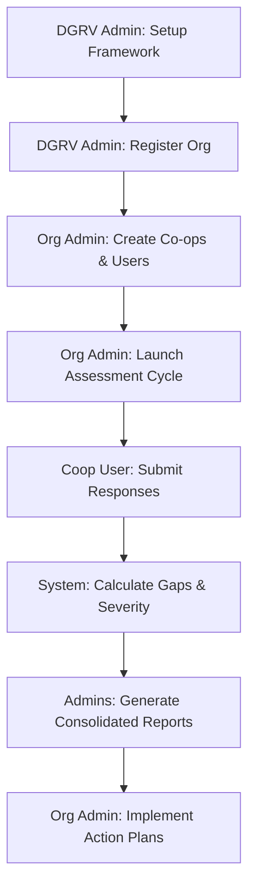

# Digital Gap Assessment Tool: Official Master Handover & Operational Manual

## 1. Vision & Purpose
The **Digital Gap Assessment Tool** is a high-performance, analytical platform engineered to catalyze digital transformation within the DGRV ecosystem. It systematically benchmarks the **Current Reality** against **Strategic Targets**, generating a quantitative **Digital Gap Score**. This tool is not just an assessment platform—it is a strategic compass providing automatic **Action Plans** for digital growth.

---

## 2. Integrated Platform Workflow
The following diagram illustrates the professional lifecycle of a digital assessment cycle:

---

## 3. Tiered Role-Based Operations

### 3.1 DGRV Administrator (System Architect)
*   **Mission**: To govern the global standards and organizational landscape.
*   **Core Tasks**:
    | Action | Procedure | Expected Result |
    | :--- | :--- | :--- |
    | **Org Registration** | **Admin > Organizations > New** | Entity is created and ready for onboarding. |
    | **Framework Setup** | **Dimensions > Create** | Measurement categories (e.g., Finance, Tech) are defined. |
    | **Granting Access** | **Invitations > Org Admin** | Client leadership receives secure access. |
    | **Global Monitoring** | **Consolidated Reports** | View average maturity across the entire ecosystem. |

### 3.2 Organization Administrator (Strategic Director)
*   **Mission**: To orchestrate digital audits across a network of cooperatives.
*   **Core Tasks**:
    | Action | Procedure | Expected Result |
    | :--- | :--- | :--- |
    | **Co-op Mapping** | **Groups > Add Cooperative** | Decentralized entities are registered. |
    | **Cycle Launch** | **Assessments > Create New** | A time-bound assessment window is opened. |
    | **Resource Assignment** | **Manage > Assign Dimensions** | Specific topics are delegated to specific co-ops. |
    | **Audit Insight** | **Reports > Organization View** | Identifying systemic weaknesses in the union. |

### 3.3 Cooperative User (Data Practitioner)
*   **Mission**: To provide precise, ground-truth data regarding local digital capability.
*   **Core Tasks**:
    1.  **Dashboard Entry**: Log in to see your assigned dimensions.
    2.  **Gap Evaluation**: 
        *   **Standard Selection**: Choose the *Current State* that describes your reality today.
        *   **Target Selection**: Choose the *Desired State* for the next 12 months.
    3.  **Submission**: Finalize the section to trigger the automated gap analysis.

---

## 4. Advanced "Professional-Grade" Features

### 4.1 Hybrid Connectivity (Offline Capability)
> [!IMPORTANT]
> The platform is equipped with advanced **Service Worker** technology.
*   **Uninterrupted Access**: You can continue reading your profiles and viewing existing data even when the internet connection is unstable.
*   **Network First Strategy**: The app will always try to get the freshest data, but will fallback to a cached version in "Dead Zones" to ensure organizational productivity.

### 4.2 Multi-Language Support
The tool is fully internationalized to support local regional needs:
*   **Supported**: English, French, German, Portuguese, Zulu, and siSwati.
*   **Usage**: The language toggle in the **Navigation Bar** updates the entire UI—including forms and reports—to the chosen dialect instantly.

### 4.3 Automated Action Plans
Once a highly severe gap is identified (HIGH), the system doesn't just show a red alert.
*   **Recommendations**: The system pulls from a library of professional advice to suggest the next move.
*   **Action Plan Downloads**: Admins can download a specific "Action Plan PDF" for every gap to guide the cooperative's upgrade path.

---

## 5. Interpreting the Assessment Data
| Severity | Description | Organizational Impact |
| :--- | :--- | :--- |
| **🟢 LOW** | < 20% Variance | The digital standard is met. Maintain current infrastructure. |
| **🟡 MEDIUM** | 20% - 50% Variance | **Modernize**. A training or software upgrade is required. |
| **🔴 HIGH** | > 50% Variance | **CRITICAL**. High risk of operational failure. Immediate budget allocation required. |

---

## 6. Handover & Troubleshooting
*   **Access Denied?** Ensure your specific Role (Admin/User) was correctly assigned by your Org Admin.
*   **Dashboard Empty?** Check with your admin if the current Assessment Cycle is active or if it has been "Archived."
*   **Report Not Downloading?** Ensure your browser allows pop-ups for the tool's domain.

---
*This document constitutes the official handover guide for users of the DGRV Digital Gap Assessment Tool. For further deep-dives into the architecture, please refer to the `doc/Arc42.md` document.*
