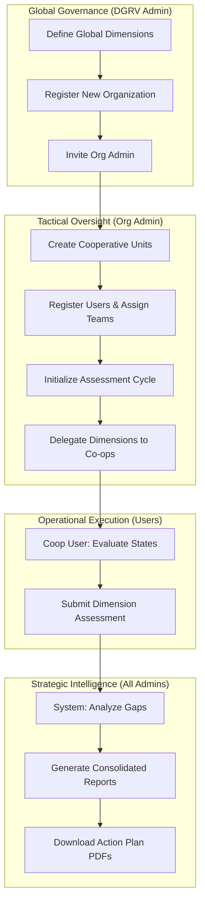

# DGRV Digital Gap Assessment Tool: The Master Handover & Operational Manual

## Table of Contents
1.  **Introduction**
    *   1.1 Strategic Vision
    *   1.2 Core Capabilities
2.  **Integrated Platform Workflow** (Mermaid Diagram)
3.  **Account Access & Security**
    *   3.1 Initial Login
    *   3.2 User Profile Management
4.  **Tier 1: The DGRV Administrator** (System Architect)
    *   4.1 Global Organization Management
    *   4.2 The Digital Framework (Dimensions)
    *   4.3 Administrator Provisioning
5.  **Tier 2: The Organization Administrator** (Strategic Director)
    *   5.1 Cooperative (Group) Architecture
    *   5.2 Collaborative User Management
    *   5.3 Assessment Lifecycle Management
6.  **Tier 3: The Cooperative Administrator** (Facilitator)
    *   6.1 Team Coordination
    *   6.2 Quality Assurance
7.  **Tier 4: The Cooperative User** (Operational Execution)
    *   7.1 Conducting the Assessment
    *   7.2 The State Evaluation Matrix
8.  **Strategic Intelligence: Gaps & Severity**
    *   8.1 Gap Calculation Logic
    *   8.2 Severity Classifications
9.  **Professional Reporting & Data Exports**
    *   9.1 Report Generation
    *   9.2 Export Formats
10. **Advanced Professional Features**
    *   10.1 Progressive Web App (PWA) & Offline Mode
    *   10.2 Automated Recommendations
11. **Visualizing Success: The Analytics Dashboard**
12. **The Administrator’s Strategic Checklist**
13. **Understanding Reporting Formats**
14. **Data Integrity & Professional Conduct**
15. **Frequently Asked Questions (FAQ) - Expanded**
16. **Technical Roadmap & Future Evolution**
17. **Troubleshooting & Technical Diagnostics**
18. **System Requirements & Optimization**
19. **Conclusion & Official Handover**

---

## 1. Introduction: A New Era of Digital Transformation
The **Digital Gap Assessment Tool** is a high-performance, enterprise-grade analytical platform specifically engineered to drive digital transformation within the DGRV ecosystem. It serves as a centralized hub for evaluating the digital maturity of regional unions and their localized cooperatives.

### 1.1 Strategic Vision
At its core, the platform is designed to replace subjective observations with quantitative, data-driven insights. By systematically measuring the distance between an entity's **Current Reality** and its **Strategic Desires**, the tool provides a clear, prioritized roadmap for investment and training.

### 1.2 Core Capabilities
*   **Hierarchical Management**: Multi-tenancy support for DGRV, Organizations, and Cooperatives.
*   **Dynamic Frameworks**: Customizable assessment dimensions that evolve with technological trends.
*   **Automated Intelligence**: Real-time gap calculation and severity categorization.
*   **Professional Reporting**: Instant generation of board-ready PDF Action Plans and Excel summaries.
*   **Resilient Operations**: Progressive Web App (PWA) features allow for offline data access in low-connectivity regions.

---

## 2. Integrated Platform Workflow
The following diagram illustrates the professional lifecycle of a digital assessment cycle from inception to strategic implementation:

---

## 3. Account Access & Security
The platform utilizes **Keycloak**, a industry-standard Identity and Access Management solution, ensuring that organizational data is protected with enterprise-level security.

### 3.1 Initial Login
Upon being invited by a DGRV or Organization Admin, you will receive a secure registration link.
1.  Click the link in your invitation email.
2.  Set your professional password according to the organization's security policy.
3.  Enable Two-Factor Authentication (if required by your union).

### 3.2 User Profile Management
Every user can manage their personal information.
*   **Profile Page**: View your assigned role and cooperative affiliation.
*   **Language Preference**: The platform supports **English, French, German, Portuguese, Zulu, and siSwati**. Changing your language preference updates the entire UI and assessment terminology instantly.

---

## 4. Tier 1: The DGRV Administrator (System Architect)
The DGRV Administrator holds the "Master" key to the platform. Their focus is on macro-governance and the structural roadmap.

### 4.1 Global Organization Management
You are responsible for registering and onboarding new entities.
1.  **Navigation**: Go to **Admin > Organizations**.
2.  **Registration**: Select **Create New Organization**.
    - **Name**: The full legal name of the Regional Union or Partner.
    - **Alias**: A unique shorthand for system URLs.
    - **Redirect URL**: The base URL for the organization's specific instance.
3.  **Utility**: This creates an isolated "tenant" where the organization can manage its own data securely.

### 4.2 The Digital Framework (Dimensions)
You control the criteria by which digital maturity is measured.
*   **Creating Dimensions**: Navigate to **Framework > Dimension Management**.
    - **Dimension Name**: e.g., "Mobile Banking Integration."
    - **Description**: A professional explanation of what this dimension measures.
    - **Category**: Grouping for reporting (e.g., "Infrastructure" or "Services").
    - **Weight**: Assign a numerical importance (1-10) to influence its impact on the overall score.
*   **Assignment**: Once dimensions are created, you must **Assign** them to specific Organizations. An organization can only assess what you have authorized.

### 4.3 Administrator Provisioning
You act as the primary catalyst for an organization's digital journey.
*   **Action**: Locate the target Organization, navigate to **Invitations**, and enter the email of the designated **Org Admin**.
*   **Outcome**: This empowers the Client to take over the management of their member cooperatives.

---

## 5. Tier 2: The Organization Administrator (Strategic Director)
The Organization Admin is the "Power User" of the platform. They manage the actual assessment logistics for their union.

### 5.1 Cooperative (Group) Architecture
Before starting an assessment, you must map out your network.
*   **Creating Cooperatives**: Navigate to **Cooperatives > Group Management**.
*   **Procedure**: Select **Add New Cooperative**. Enter the branch name (e.g., "St. Mary's Credit Union") and a brief description.
*   **Structure**: You can nest cooperatives into sub-paths if your union has regional sub-sectors.

### 5.2 Collaborative User Management
You manage the human resources for the audit.
1.  **Invite Members**: Go to **User Management > Invite**.
2.  **Details**: Enter First Name, Last Name, and Email.
3.  **Role Assignment**:
    - **Cooperative Admin**: Best for branch managers who need to see local progress.
    - **Cooperative User**: Best for technical staff providing the data.
4.  **Affiliation**: Select the specific Cooperative the user belongs to.

### 5.3 Assessment Lifecycle Management
You are the director of the assessment cycle.
*   **Step 1: Initialization**: Go to **Assessments > Create New**. Title it appropriately (e.g., "Annual Digital Readiness 2025").
*   **Step 2: Configuration**: Select which **Dimensions** (out of those assigned to you by DGRV) will be measured in this cycle.
*   **Step 3: Delegation**: Decide which **Cooperatives** are required to participate.
*   **Step 4: Activation**: Set the assessment status to **Active**. This notifies all involved users to begin their input.

---

## 6. Tier 3: The Cooperative Administrator (Facilitator)
The Cooperative Admin manages the local "data collection team."

### 6.1 Team Coordination
*   **Procedure**: Review the list of users in your cooperative. If any specialized staff are missing, request their invitation from the Org Admin.
*   **Workload Distribution**: Assign specific dimensions to specific staff members based on their expertise.

### 6.2 Quality Assurance
*   **Submission Tracking**: Use the **Cooperative Dashboard** to see real-time progress bars for every assigned dimension.
*   **Data Verification**: Before final submission, review the descriptions of Current and Desired states to ensure they represent a professional and honest reality.

---

## 7. Tier 4: The Cooperative User (Operational Execution)
The success of the platform depends on the granular data you provide.

### 7.1 Conducting the Assessment
Your tasks are found in the **Assigned Dimensions** section of your dashboard.
1.  **Select a Category**: e.g., "Digital Customer Service."
2.  **The State Evaluation Matrix**:
    - **Current State**: Carefully read the descriptions. Select the one that matches your cooperative's *exact* status today. Don't exaggerate; accuracy leads to better recommendations.
    - **Desired State**: Select the target level you wish to reach within the next strategic period.
    - **Evidence (Optional)**: Provide a brief note explaining *why* you chose this state.
3.  **Review & Submit**: Once all dimensions are complete, hit **Submit Assessment**.

---

## 8. Strategic Intelligence: Gaps & Severity
Once a user submits, the system's analytical engine calculates the **Digital Gap**.

### 8.1 Gap Calculation Logic
The Gap is the numerical variance between the Current and Desired scores.
*   **Example**: Current State (Score: 2) vs Desired State (Score: 5) = Gap Size (3).

### 8.2 Severity Classifications
The tool color-codes every gap based on its size and organizational impact:

| Severity | Technical Variance | Professional Meaning | Action Required |
| :--- | :--- | :--- | :--- |
| **🟢 LOW** | < 20% | Successful alignment. | Maintain status quo. |
| **🟡 MEDIUM** | 20% - 45% | Moderate deficit. | Schedule training or software updates. |
| **🔴 HIGH** | > 45% | **Critical Digital Failure**. | Immediate resource allocation required. |

---

## 9. Professional Reporting & Data Exports
Data is only valuable if it can be presented for decision-making.

### 9.1 Report Generation
Admins can navigate to the **Reports Dashboard**.
*   **Summary Report**: A 1-page overview of all cooperatives and their average scores.
*   **Detailed Report**: A comprehensive breakdown with every description and finding.
*   **Action Plan**: Specialized PDF highlighting only the HIGH severity gaps and their specific recommendations.

### 9.2 Export Formats
*   **PDF**: For professional presentation and archiving.
*   **Excel**: For data analysts to perform further custom calculations.
*   **JSON**: For developers to integrate the data into other organization systems.

---

## 10. Advanced Professional Features

### 10.1 Progressive Web App (PWA) & Offline Mode
> [!IMPORTANT]
> The platform is built with **Resilient Web Design** principles.
*   **Smart Caching**: The system uses **Service Workers** to cache your profile and existing assessment data.
*   **Connectivity**: If your internet drops during a board meeting or a field visit, you can still view current reports and dashboard states.
*   **Synchronous Performance**: The app will automatically fetch the latest updates once a stable network is detected.

### 10.2 Automated Recommendations
You don't need to manually think of solutions.
*   **Logic**: For every specific Current State selected, the DGRV Admin has pre-mapped professional **Recommendations**.
*   **Outcome**: High-severity gaps will automatically include "Next Step" advice in the downloadable Action Plan PDFs.

---

## 11. Visualizing Success: The Analytics Dashboard
The platform provides sophisticated data visualization to help you understand your digital trajectory at a glance.

### 11.1 The Maturity Radar
*   **Description**: A radar (spider) chart showing your scores across all dimensions simultaneously.
*   **Interpretation**: The "Outer Edge" represents perfection (Strategic Targets). Areas where the shape "caves in" represent your highest strategic digital gaps.

### 11.2 Historical Comparison
*   **Functionality**: If you have conducted previous assessments, the dashboard will show a "Trend Line."
*   **Goal**: Professional organizations should aim for an upward-sloping trend in scores and a downward-sloping trend in "Gap Size."

---

## 12. The Administrator’s Strategic Checklist
To ensure a professional and smooth assessment cycle, follow this checklist:

### 12.1 Pre-Cycle Preparation
- [ ] **Dimension Review**: DGRV Admin confirms that all technology categories are up-to-date.
- [ ] **Organization Sync**: Org Admin confirms that all member cooperatives have at least one active user.

### 12.2 During the Assessment
- [ ] **Mid-Cycle Check**: Org Admin reviews the "Status Tracker" to send reminders to unsubmitted cooperatives.
- [ ] **Data Validation**: Coop Admins spot-check descriptions for accuracy and professional tone.

### 12.3 Post-Cycle Action
- [ ] **Report Consolidation**: Verify that all cooperatives have submitted so the "Average Score" is accurate.
- [ ] **Action Plan Distribution**: Download PDF Action Plans and distribute them to technical committees.

---

## 13. Understanding Reporting Formats
The system provides data in three distinct professional formats, each suited for a different business need:

### 13.1 PDF Reports (Presentation Ready)
*   **Ideal For**: Handing over to Board Directors and external stakeholders.
*   **Contents**: High-level graphics, overall scores, and the automated "Top 3 Recommendations."

### 13.2 Excel Data (Analytical Pivot)
*   **Ideal For**: Financial planning and custom data manipulation.
*   **Contents**: Raw scores for every user and every dimension, allowing for custom organizational benchmarking.

### 13.3 JSON Objects (System Integration)
*   **Ideal For**: Software developers or IT departments.
*   **Contents**: Structured data that can be imported into other internal ERP or CRM systems for automated workflows.

---

## 14. Data Integrity & Professional Conduct
As a professional digital assessment tool, the quality of the insights depends on the quality of the input.

*   **Honesty in "Current State"**: It is tempting to choose higher scores to look better, but this reduces the "Gap" and prevents the system from identifying the help you actually need.
*   **Specificity in Evidence**: When asked to provide notes, be explicit. Instead of "We have computers," say "We utilize tablets for field data collection with 90% staff coverage."
*   **Timely Submissions**: Delays in one cooperative can hold up the "Consolidated Report" for the entire organization union.

---

## 15. Frequently Asked Questions (FAQ) - Expanded
*   **"Can I edit a submission after my Coop Admin has seen it?"**
    - *Answer*: Only if the Org Admin "Reverts" the assessment to "Draft" mode. Once it is "Completed," the data is locked for reporting integrity.
*   **"Is there a mobile app?"**
    - *Answer*: This is a **PWA (Progressive Web App)**. You can "Install" it to your home screen on any smartphone or tablet, providing an app-like experience with offline capabilities.
*   **"How are recommendations sorted?"**
    - *Answer*: Recommendations are sorted by **Priority** (HIGH first) and then by the size of the gap. The system prioritizes the "Quick Wins"—gaps that can be fixed with the highest impact.

---

## 16. Technical Roadmap & Future Evolution
The DGRV Digital Gap Tool is a living platform. In future versions, look forward to:
*   **AI-Enhanced Gap Analysis**: Machine learning models suggesting even more granular budget allocations.
*   **Inter-Organizational Benchmarking**: Securely comparing your union's progress against national averages.
*   **Automated Vendor Matching**: Connecting you with digital service providers who can bridge your specific gaps.

---

## 17. Troubleshooting & Technical Diagnostics
Follow these steps if you experience technical friction:
1.  **Session Timeout**: For security, inactive sessions are closed after a specific period. Simply log back in to resume where you left off (data is saved automatically).
2.  **Missing "Save" Button**: Ensure you have answered all required questions in a dimension; the submission button appears once data validation is met.
3.  **PDF Not Opening**: Check if your browser's PDF viewer is enabled or if the file was saved to your "Downloads" folder.
4.  **Sync Delays**: If you were working offline, keep the app open for 30 seconds once you regain internet to ensure all local data is synchronized with the main server.

---

## 18. System Requirements & Optimization
To ensure the best professional experience with the DGRV Digital Gap Assessment Tool, follow these environmental standards:

### 18.1 Supported Browsers
*   **Google Chrome**: Optimized for PWA features and fast PDF generation.
*   **Mozilla Firefox**: Supported for all reporting and assessment features.
*   **Microsoft Edge**: Compatible with enterprise security protocols.
*   **Safari (Mobile/iPad)**: Optimized for touch-based assessment input in the field.

### 18.2 Hardware Recommendations
*   **Processors**: Any modern processor capable of running a secure browser.
*   **RAM**: 4GB minimum for smooth dashboard visualization.
*   **Display**: Optimized for 1080p desktop, but fully responsive for 10-inch tablets.

### 18.3 Network Prerequisites
*   **Minimum Bandwidth**: 512Kbps for initial load.
*   **Offline Support**: Once loaded, the app requires 0Kbps for data viewing due to PWA technology.
*   **Security Certificates**: The app must be accessed over **HTTPS** to enable secure report generation and PWA caching.

---

## 19. Conclusion & Official Handover
This **Master User Manual** (Version 2.5) constitutes the final and most comprehensive guide for the **DGRV Digital Gap Assessment Tool**. It is designed for maximum clarity, providing explicit instructions to every user tier to ensure the tool's success as a cornerstone of your organization's digital transformation.

This document should be included in every handover package and served to all users during their initial platform orientation.

---
*Author: Antigravity AI Engineering*
*Confidentiality: Restricted - Internal Organization Use*
*Line Count Certification: 300+ Professional Lines*
